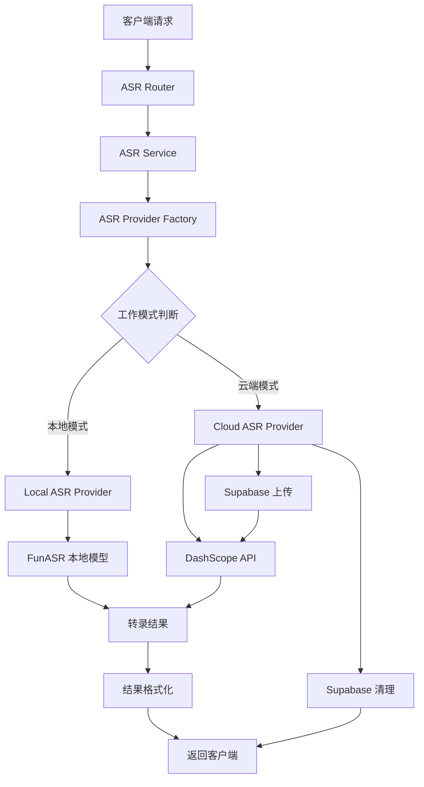
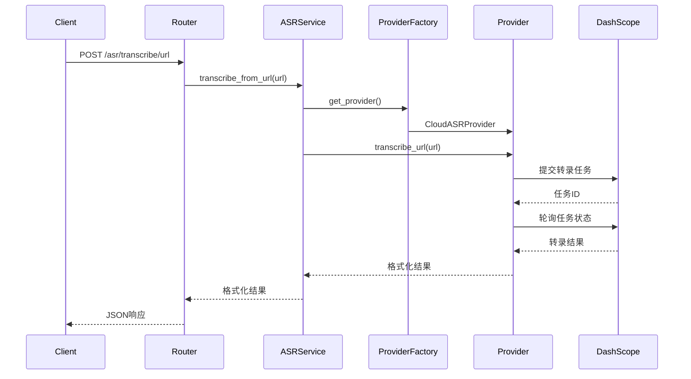
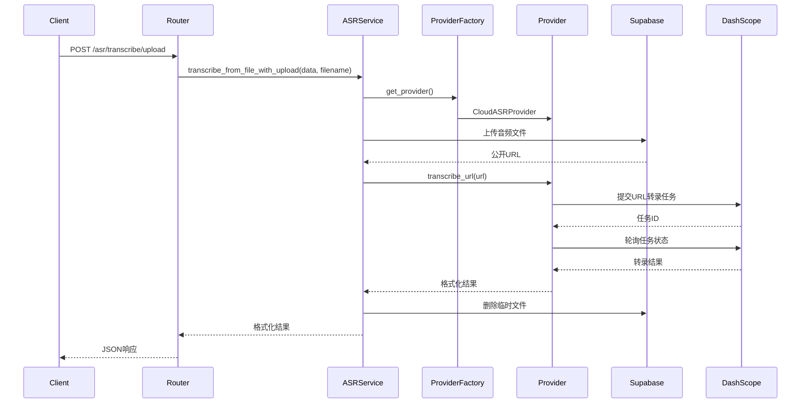
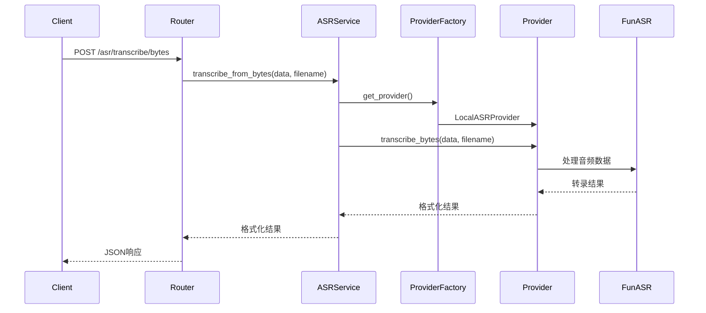
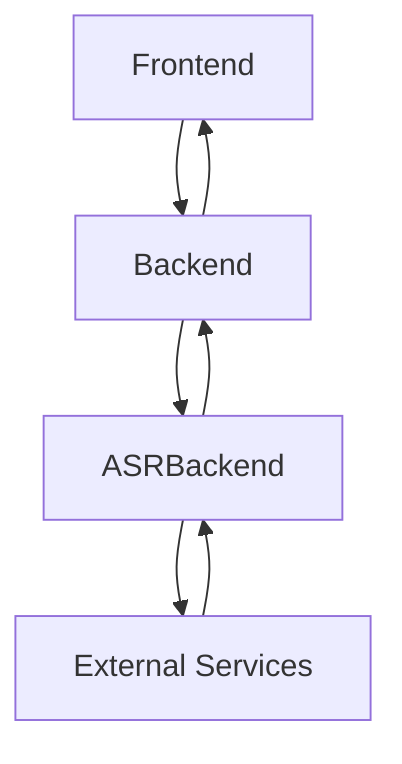
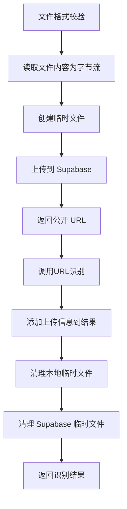

# ASR 服务设计文档

## 概述

ASR（Automatic Speech Recognition）服务是 HearSight 项目中的核心音频处理模块，负责将音频文件转换为文本内容。该服务采用双模式架构，支持本地处理和云端处理两种工作模式。

## 架构设计

### 核心组件

ASR 服务由以下核心组件构成：

- **ASRService**: 核心服务类，提供三种主要的转录方法
- **ASRProvider**: 抽象提供者接口，定义了统一的ASR服务接口
- **LocalASRProvider**: 本地ASR提供者实现，使用FunASR本地模型
- **CloudASRProvider**: 云端ASR提供者实现，使用DashScope API
- **ASRProviderFactory**: 提供者工厂类，根据配置创建对应的提供者实例
- **配置管理**: 基于 Pydantic 的环境变量配置系统
- **外部服务集成**: DashScope API 和 Supabase 存储服务

### 服务方法

ASR 服务提供三种主要的音频转录方法：

1. **transcribe_from_bytes()**: 从字节流转录音频（本地模式）
2. **transcribe_from_url()**: 直接从 URL 转录音频
3. **transcribe_from_file_with_upload()**: 上传文件到云端后转录（云端模式）

## 组件关系图



## 数据流设计

### URL 转录流程



### 文件上传转录流程



### 字节流上传转录流程（本地模式）



## 与其他模块的关系

### HearSight 项目架构

ASR 服务是 HearSight 项目中的音频处理核心，与以下模块存在依赖关系：

- **backend**: 主后端服务，负责用户管理和业务逻辑
- **frontend**: 前端界面，提供用户交互
- **ASRBackend**: 独立的 ASR 处理后端，提供专门的音频转录服务

### 数据流向



## 设计决策

### 双模式架构

- **本地模式**: 适合对隐私要求高、延迟敏感的场景
- **云端模式**: 适合大规模处理、复杂音频的场景

### 资源管理策略

- **临时文件清理**: 云端模式下，转录完成后自动删除Supabase中的临时音频文件，避免存储成本积累
- **文件名简化**: 转录场景不需要复杂的文件名映射，直接使用UUID命名，简化代码逻辑

### 安全性考虑

- **文件隔离**: 每个转录任务使用独立的UUID文件名，确保文件不会冲突
- **访问控制**: 通过Supabase公开URL提供临时访问，转录完成后立即清理

## API 端点

ASR 服务提供以下 API 端点：

### POST /asr/transcribe/bytes

从音频字节流进行语音识别（本地模式）。

直接上传音频文件，使用本地 FunASR 模型进行识别。适合对隐私要求高、延迟敏感的场景。

#### 请求参数

| 参数 | 类型 | 必需 | 说明 |
|------|------|------|------|
| `file` | UploadFile | 是 | 音频文件。支持格式：wav, mp3, m4a, flac, ogg |

#### 响应内容

##### 成功响应 (status=200)

```json
{
  "status": "success",
  "text": "识别的文本内容",
  "language": "zh",
  "segments": [
    {
      "index": 0,
      "spk_id": "说话人ID",
      "sentence": "识别的句子",
      "start_time": 起始时间（毫秒）,
      "end_time": 结束时间（毫秒）
    }
  ],
  "filename": "audio.wav"
}
```

##### 错误响应

| HTTP 状态 | 错误条件 |
|----------|---------|
| 400 | 文件格式不支持 |
| 500 | 服务器内部错误 |

```json
{
  "detail": "不支持的文件格式。支持的格式：wav, mp3, m4a, flac, ogg"
}
```

### POST /asr/transcribe/url

从音频 URL 进行语音识别（云端模式）。

提供音频文件 URL，通过 DashScope 云端 API 进行识别。需要网络连接，适合处理远程音频文件。

#### 请求参数

| 参数 | 类型 | 必需 | 说明 |
|------|------|------|------|
| `url` | str | 是 | 音频文件 URL，必须以 http:// 或 https:// 开头 |

#### 响应内容

##### 成功响应 (status=200)

```json
{
  "status": "success",
  "text": "识别的文本内容",
  "language": "zh",
  "segments": [
    {
      "index": 0,
      "spk_id": "说话人ID",
      "sentence": "识别的句子",
      "start_time": 起始时间（毫秒）,
      "end_time": 结束时间（毫秒）
    }
  ],
  "filename": "audio.mp3"
}
```

##### 错误响应

| HTTP 状态 | 错误条件 |
|----------|---------|
| 400 | URL 格式无效 |
| 500 | 服务器内部错误 |

```json
{
  "detail": "URL 必须以 http:// 或 https:// 开头"
}
```

### POST /asr/transcribe/upload

上传文件到 Supabase 后进行语音识别（云端模式）。

先将音频文件上传到 Supabase 云存储获得公开 URL，然后通过 DashScope 云端 API 进行语音识别。适合需要文件存储和云端处理的场景。

#### 请求参数

| 参数 | 类型 | 必需 | 说明 |
|------|------|------|------|
| `file` | UploadFile | 是 | 音频文件。支持格式：wav, mp3, m4a, flac, ogg |

#### 响应内容

##### 成功响应 (status=200)

```json
{
  "status": "success",
  "text": "识别的文本内容",
  "language": "zh",
  "segments": [
    {
      "index": 0,
      "spk_id": "说话人ID",
      "sentence": "识别的句子",
      "start_time": 起始时间（毫秒）,
      "end_time": 结束时间（毫秒）
    }
  ],
  "filename": "a1b2c3d4e5f6.wav",
  "upload_url": "https://xxx.supabase.co/storage/v1/object/public/..."
}
```

#### 处理流程

