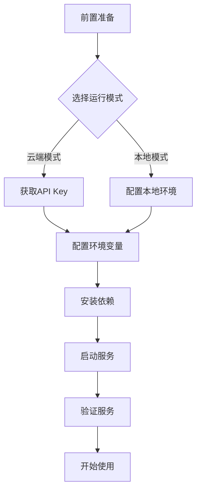

# ASR Backend 快速开始指南

本文档介绍如何启动 ASR Backend 服务。

## 前置准备

确保已完成环境配置。详见 `快速配置.md` 文档。

复制 `.env.example` 为 `.env` 并填入相关配置。

根据运行模式安装对应依赖。

## 启动流程概览



## 云端模式启动（推荐）

云端模式轻量级，适合大多数场景。

### 步骤 1：获取 API Key

访问阿里云 DashScope 控制台 https://dashscope.console.aliyun.com/ 获取 API Key。

若未有阿里云账户，需先注册。

### 步骤 2：配置环境

编辑 `.env` 文件，填入 DashScope API Key。

```env
ASR_MODE=cloud
DASHSCOPE_API_KEY=sk-xxx
```

### 步骤 3：安装依赖

```bash
pip install -r requirements-cloud.txt
```

### 步骤 4：启动服务

```bash
python main.py
```

服务将在 `http://localhost:8003` 启动。

### 步骤 5：验证服务

打开浏览器访问 `http://localhost:8003/docs`，进入 Swagger 文档界面测试 API。

或使用命令行测试。

```bash
curl http://localhost:8003/health
```

健康检查返回 `{"status": "healthy", "service": "ASR Backend"}` 表示启动成功。

## 本地模式启动

本地模式完全离线运行，首次运行需下载模型文件，耗时较长。

### 步骤 1：配置环境

编辑 `.env` 文件，设置运行模式为本地。

```env
ASR_MODE=local
```

### 步骤 2：安装依赖

```bash
pip install -r requirements-local.txt
```

安装过程可能较长，取决于网络速度。

### 步骤 3：启动服务

```bash
python main.py
```

首次启动会下载并初始化模型，可能需要 5-10 分钟，这属于正常现象。

### 步骤 4：验证服务

等待模型加载完成后，服务启动成功。

```bash
curl http://localhost:8003/health
```

## Docker 启动

### 云端模式（轻量级）

```bash
docker build -f Dockerfile.cloud -t hearsight-asr:cloud .

docker run -p 8003:8003 \
  -e ASR_MODE=cloud \
  -e DASHSCOPE_API_KEY=sk-xxx \
  hearsight-asr:cloud
```

### 本地模式（完整镜像）

```bash
docker build -f Dockerfile.local -t hearsight-asr:local .

docker run -p 8003:8003 \
  -e ASR_MODE=local \
  hearsight-asr:local
```

### Docker Compose

直接使用 docker-compose 启动服务。

```bash
docker-compose up asr_backend
```

## 基本使用

### 查看 API 文档

访问 http://localhost:8003/docs 进入交互式 API 文档。

### 获取服务信息

```bash
curl http://localhost:8003/asr/info
```

返回当前运行模式、模型配置等信息。

### URL 转录

使用公开的音频 URL 进行转录。

```bash
curl -X POST "http://localhost:8003/asr/transcribe" \
  -d "url=https://www.voiptroubleshooter.com/open_speech/american/OSR_us_000_0010_8k.wav"
```

### 文件上传转录

上传本地音频文件进行转录。

```bash
curl -X POST "http://localhost:8003/asr/transcribe" \
  -F "file=@audio.mp3"
```

### Python 调用

```python
import requests

# 文件上传
with open("audio.mp3", "rb") as f:
    files = {"file": f}
    response = requests.post("http://localhost:8003/asr/transcribe", files=files)
    print(response.json())

# URL 转录
response = requests.post(
    "http://localhost:8003/asr/transcribe",
    data={"url": "https://example.com/audio.wav"}
)
print(response.json())
```

## 服务停止

按 `Ctrl+C` 停止服务。

若使用 Docker，执行 `docker stop` 命令停止容器。

## 调试模式

启用调试模式查看详细日志。

编辑 `.env` 文件。

```env
DEBUG=true
```

或直接设置环境变量启动。

```bash
DEBUG=true python main.py
```

调试模式下会输出详细的日志信息，有助于定位问题。

## 常见问题

### 服务无法启动

检查端口 8003 是否被占用。修改 `PORT` 环境变量使用其他端口。

检查依赖是否完整安装，可尝试重新安装。

```bash
pip install --upgrade -r requirements-cloud.txt
```

### 云端模式无法连接

确认 DashScope API Key 正确有效。

检查网络连接是否正常。

### 本地模式运行缓慢

本地模式首次运行需加载大型模型文件，属于正常现象。

可将模型下载到固定位置加速后续启动。

若运行速度仍然很慢，考虑使用云端模式。

### 文件上传失败

确认已配置 Supabase 相关环境变量。

检查 Supabase 配置是否有效。

确认音频文件格式支持且文件大小在限制内。

