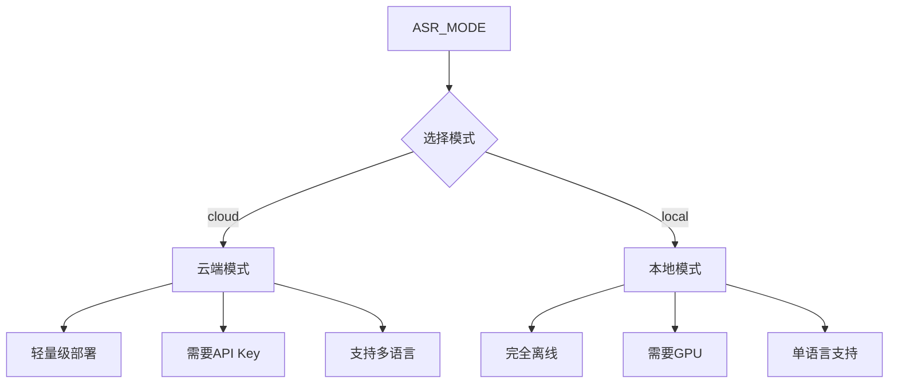

# ASR Backend 快速配置指南

本文档介绍如何配置 ASR Backend 服务运行环境。


## 环境要求

Python 版本 3.8 或以上。

系统依赖根据运行模式不同而异。本地模式需要 CUDA 工具链支持 GPU 加速，云端模式无此要求。

网络连接仅云端模式需要。

## 依赖安装

### 通用依赖

所有模式都需要的基础依赖。

```bash
pip install -r requirements.txt
```

### 云端模式依赖

云端模式只需要轻量级依赖。

```bash
pip install -r requirements-cloud.txt
```

### 本地模式依赖

本地模式需要 PyTorch 和相关计算库，可能较大且耗时较长。

```bash
pip install -r requirements-local.txt
```

或通过国内镜像加速安装。

```bash
pip install -r requirements-local.txt -i https://pypi.tsinghua.edu.cn/simple
```

## 环境变量配置

复制示例文件作为配置文件。

```bash
cp .env.example .env
```

根据需要修改 `.env` 文件中的配置项。

### 基本配置

| 变量 | 说明 | 默认值 |
|------|------|--------|
| `APP_NAME` | 应用名称 | HearSight ASR Backend |
| `DEBUG` | 调试模式 | true |
| `PORT` | 服务端口 | 8003 |

## 运行模式选择

通过 `ASR_MODE` 环境变量选择运行模式。

`ASR_MODE=cloud` 为云端模式，轻量级部署，使用阿里云 DashScope API。

`ASR_MODE=local` 为本地模式，离线运行，使用 FunASR 本地模型。



```env
ASR_MODE=cloud
```

### 云端模式配置

配置云端模式需要以下环境变量。

**DashScope API Key**

从阿里云控制台获取 API Key。访问 https://dashscope.console.aliyun.com/ 注册并获取。

```env
DASHSCOPE_API_KEY=sk-xxx
```

**DashScope 模型**

默认使用 `paraformer-v2` 模型，这是推荐配置。

```env
DASHSCOPE_MODEL=paraformer-v2
```

**语言提示**

指定支持的语言，用逗号分隔。支持中文（zh）和英文（en）。

```env
DASHSCOPE_LANGUAGE_HINTS=zh,en
```

**Supabase 配置（可选，用于文件上传）**

若需要上传文件到云端存储，需要配置 Supabase。

```env
SUPABASE_URL=https://xxx.supabase.co
SUPABASE_KEY=your-api-key
SUPABASE_BUCKET_NAME=audio-storage
SUPABASE_FOLDER_NAME=uploads
SUPABASE_ADMIN_EMAIL=admin@example.com
SUPABASE_ADMIN_PASSWORD=admin-password
```

### 本地模式配置

配置本地模式需要以下环境变量。

**模型配置**

配置使用的 FunASR 模型及其版本。

```env
LOCAL_MODEL_NAME=paraformer-zh
LOCAL_MODEL_REVISION=v2.0.4
```

**VAD 模型**

语音活动检测模型，用于自动分割音频中的有声段。

```env
LOCAL_VAD_MODEL=fsmn-vad
LOCAL_VAD_MODEL_REVISION=v2.0.4
```

**标点模型**

自动添加标点符号的模型。

```env
LOCAL_PUNC_MODEL=ct-punc-c
LOCAL_PUNC_MODEL_REVISION=v2.0.4
```

**说话人模型**

用于说话人识别的模型。

```env
LOCAL_SPK_MODEL=cam++
```

## 配置验证

启动应用前可以验证配置是否正确。

```python
from ASRBackend.config import settings

# 检查基本配置
print(f"运行模式: {settings.asr_mode}")
print(f"调试模式: {settings.debug}")
print(f"服务端口: {settings.port}")

# 验证云端模式配置
if settings.is_cloud_mode():
    settings.validate_config()
    print("云端模式配置有效")
```

## 常见配置场景

### 快速云端部署

仅需配置 DashScope API Key。

```env
ASR_MODE=cloud
DASHSCOPE_API_KEY=sk-xxx
```

### 本地离线运行

仅需配置运行模式。

```env
ASR_MODE=local
```

### 云端模式带文件上传

需要配置 DashScope 和 Supabase。

```env
ASR_MODE=cloud
DASHSCOPE_API_KEY=sk-xxx
SUPABASE_URL=https://xxx.supabase.co
SUPABASE_KEY=your-api-key
```

## Docker 环境配置

使用 Docker 运行时，可通过环境变量覆盖配置。

```bash
docker run -p 8003:8003 \
  -e ASR_MODE=cloud \
  -e DASHSCOPE_API_KEY=sk-xxx \
  hearsight-asr:latest
```

或在 docker-compose.yml 中配置。

```yaml
services:
  asr_backend:
    image: hearsight-asr:latest
    ports:
      - "8003:8003"
    environment:
      ASR_MODE: cloud
      DASHSCOPE_API_KEY: sk-xxx
```

## 配置优先级

配置覆盖优先级从高到低为：环境变量 > `.env` 文件 > 代码默认值。

环境变量最高优先级，会覆盖所有其他配置。

`.env` 文件用于本地开发配置，会覆盖代码中的默认值。

代码中的默认值最低优先级。

## 故障排查

若启动时出现配置错误，检查以下项。

云端模式下，确认 `DASHSCOPE_API_KEY` 已正确设置且有效。

若使用文件上传，确认 Supabase 相关配置完整正确。

确认 `.env` 文件的编码为 UTF-8，否则中文字符可能显示异常。

若环境变量未生效，确认变量名称正确（环境变量名不区分大小写）。
