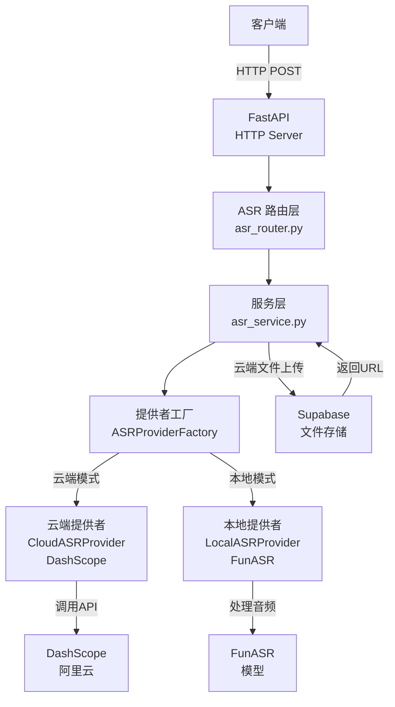
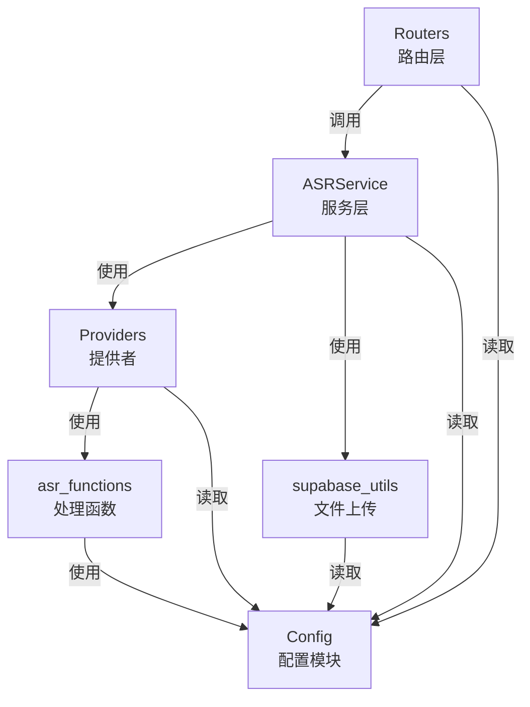

# ASR Backend 设计说明文档

本文档详细说明 ASR Backend 系统架构、数据流和核心模块设计。

## 系统概述

HearSight ASR 后端服务提供音频转文本功能，支持本地和云端两种运行模式。通过统一的 API 接口对外提供服务，屏蔽不同实现的差异。

云端模式支持文件上传功能，用户上传的文件自动存储到 Supabase，然后使用获得的公开 URL 进行转录。

## 系统架构



系统遵循分层设计原则。路由层处理 HTTP 请求和参数验证，服务层封装业务逻辑，提供者层屏蔽实现细节。

## 核心模块

### 路由层（asr_router.py）

职责是处理 HTTP 请求、参数验证、模式判断和调用服务层。

提供两个 API 端点。

POST /asr/transcribe 转录音频。接受 file 或 url 参数，但不能同时提供。本地模式同时支持两种，云端模式仅支持 url。

GET /asr/info 获取服务信息，返回当前运行模式、模型配置等信息。

### 服务层（asr_service.py）

职责是实现转录业务逻辑、统一接口和错误处理。

关键方法包括：

transcribe_from_bytes 处理文件上传，从字节流转录音频。仅本地模式支持。

transcribe_from_url 处理 URL 输入，两种模式都支持。

transcribe_from_file_with_upload 处理云端模式的文件上传，先上传到 Supabase 再转录。

统一处理异常捕获、结果格式化、日志记录和资源清理。

### 提供者层（providers.py）

职责是根据配置选择 ASR 实现，提供统一接口。

ASRProvider 是抽象基类，定义所有提供者需实现的接口。

```python
# 关键方法
transcribe_file(audio_path)      # 转录文件
transcribe_url(url)              # 转录 URL
transcribe_bytes(audio_data, filename)  # 转录二进制数据
```

LocalASRProvider 使用 FunASR 进行本地转录。支持文件和 URL 输入，首次加载模型并缓存，支持 VAD、标点、说话人分离等功能。

CloudASRProvider 使用阿里云 DashScope API 进行云端转录。仅支持 URL 输入，调用异步 API 并轮询等待结果。

ASRProviderFactory 单例工厂类，根据 settings.asr_mode 创建提供者，维护提供者实例，提供重置方法用于测试。

### 配置模块（config.py）

统一管理所有配置。使用 Pydantic BaseSettings，支持环境变量、.env 文件、代码默认值三级优先级。

配置项分为基础配置、本地模式配置、云端模式配置和 Supabase 配置。

提供 is_local_mode、is_cloud_mode、validate_config 等辅助方法。

## 数据流设计

### 本地模式文件上传流程

```
客户端上传文件
    ↓
路由层参数验证
    ↓
服务层接收字节流
    ↓
调用工厂获取本地提供者
    ↓
提供者转录文件
    ↓
返回分段结果
    ↓
格式化统一结果
    ↓
返回 JSON 响应
```

### 云端模式文件上传流程

```
客户端上传文件
    ↓
路由层参数验证
    ↓
服务层创建临时文件
    ↓
上传到 Supabase 获得公开 URL
    ↓
删除本地临时文件
    ↓
调用工厂获取云端提供者
    ↓
提供者使用 URL 转录
    ↓
轮询等待异步任务完成
    ↓
获得分段结果
    ↓
删除云端临时文件
    ↓
格式化统一结果
    ↓
返回 JSON 响应
```

### URL 转录流程

```
客户端发送 URL
    ↓
路由层参数验证
    ↓
服务层接收 URL
    ↓
调用工厂获取提供者
    ↓
提供者直接转录 URL
    ↓
返回分段结果
    ↓
格式化统一结果
    ↓
返回 JSON 响应
```

## 结果格式

### 成功响应

转录成功时返回以下结构。

```json
{
  "text": "识别的完整文本",
  "language": "识别的语言代码",
  "segments": [
    {
      "spk_id": "说话人ID",
      "sentence": "分段文本",
      "start_time": 起始时间毫秒,
      "end_time": 结束时间毫秒,
      "index": 1
    }
  ],
  "status": "success",
  "filename": "原始文件名",
  "upload_url": "云端模式文件上传时的存储 URL（可选）"
}
```

### 错误响应

转录失败时返回错误信息。

```json
{
  "status": "error",
  "error": "具体错误描述",
  "filename": "原始文件名（如果有）"
}
```

## 运行模式对比

### 本地模式

特点：完全离线运行，不需网络连接。支持文件和 URL。需要本地 GPU/CPU。占用较多系统资源。响应时间较慢。隐私性最高。

适用场景：隐私要求高、网络不稳定、离线部署环境。

配置示例：

```env
ASR_MODE=local
LOCAL_MODEL_NAME=paraformer-zh
LOCAL_VAD_MODEL=fsmn-vad
LOCAL_PUNC_MODEL=ct-punc-c
```

### 云端模式

特点：轻量级部署，无需本地 GPU。支持文件和 URL。依赖网络连接。支持多语言。需要 API Key。

适用场景：快速部署、无 GPU 环境、多语言需求、处理多文件。

配置示例：

```env
ASR_MODE=cloud
DASHSCOPE_API_KEY=sk-xxx
DASHSCOPE_LANGUAGE_HINTS=zh,en
```

## 集成关系



本地模式依赖包括 asr_sentence_segments.py（音频分段）、segment_normalizer.py（分段规范化）、utils.py（工具函数）。

云端模式依赖包括 dashscope_paraformer_v2_transcription.py（API 调用）、segment_normalizer.py（结果规范化）、utils.py（语言检测）、supabase_utils（文件上传）。

## 异常处理

服务层统一处理异常。

网络错误时返回相应错误消息和状态码。

模型加载失败时返回初始化错误。

音频处理失败时返回转录错误。

异常信息记录到日志供调试。

## 监控和调试

### 健康检查

```bash
curl http://localhost:8003/health
```

返回 `{"status": "healthy", "service": "ASR Backend"}` 表示服务正常。

### 获取服务信息

```bash
curl http://localhost:8003/asr/info
```

返回运行模式、模型配置等信息，用于验证配置是否生效。

### 调试模式

设置 `DEBUG=true` 启用详细日志输出。

调试模式下会打印请求参数、处理过程、返回结果等详细信息。

### 测试转录

使用 curl 或 Python requests 测试转录功能。

```bash
# URL 转录测试
curl -X POST "http://localhost:8003/asr/transcribe" \
  -d "url=https://www.voiptroubleshooter.com/open_speech/american/OSR_us_000_0010_8k.wav"

# 文件上传测试
curl -X POST "http://localhost:8003/asr/transcribe" \
  -F "file=@test_audio.mp3"
```

