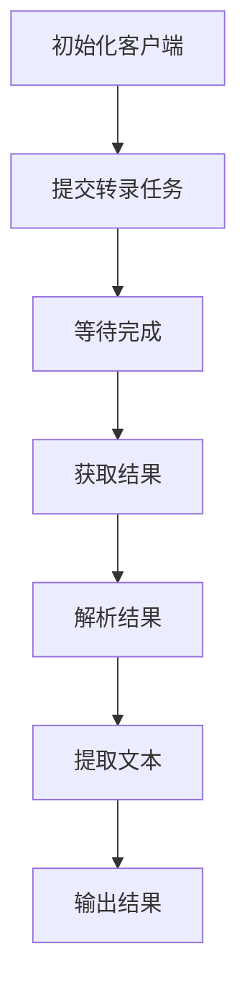

# DashScope ASR 使用示例设计文档

## 概述

本文档介绍如何使用 `example_dashscope_asr.py` 示例文件，通过阿里云 DashScope API 进行音频转录。该示例演示了完整的 ASR 流程：从提交任务到获取转录结果。

## 环境准备

### 1. 安装依赖

确保已安装必要的 Python 包：

```bash
pip install dashscope requests
```

### 2. 获取 API Key

访问 [阿里云 DashScope 控制台](https://dashscope.console.aliyun.com/) 获取 API Key。

## 配置说明

### 1. 设置环境变量

在项目根目录创建 `.env` 文件，或设置环境变量：

```bash
# 在 .env 文件中
DASHSCOPE_API_KEY=your-api-key-here

# 或设置环境变量
export DASHSCOPE_API_KEY=your-api-key-here
```

### 2. 配置文件

示例使用 `ASRBackend/config.py` 中的配置，包括：

- `dashscope_api_key`: API Key
- `dashscope_model`: 模型名称（默认 paraformer-v2）
- `dashscope_language_hints`: 语言提示（默认 zh,en）

## 运行步骤

### 1. 进入目录

```bash
cd ASRBackend/example_tests
```

### 2. 运行示例

```bash
python example_dashscope_asr.py
```

### 3. 观察输出

示例会输出转录进度和结果：

```
开始转录...
任务已提交，任务响应： {...}
任务状态： {...}
文本: The birch canoe slid on the smooth planks...
语言: en
分段数: 9
```

## 示例输出解释

### 任务提交

- 显示任务 ID 和初始状态
- 状态码 200 表示提交成功

### 任务状态

- `PENDING`: 等待处理
- `RUNNING`: 正在处理
- `SUCCEEDED`: 处理完成
- `FAILED`: 处理失败

### 转录结果

- **文本**: 完整的转录文本
- **语言**: 检测到的语言（en/zh）
- **分段数**: 句子分段数量

## 代码结构

### 主要函数

- `initialize_client()`: 初始化 DashScope 客户端
- `submit_task()`: 提交转录任务
- `wait_completion()`: 等待任务完成
- `get_result()`: 获取转录结果
- `parse_result()`: 解析 JSON 结果
- `extract_text()`: 提取完整文本
- `detect_lang()`: 检测语言

### 流程图



## 自定义使用

### 修改音频 URL

在 `main()` 函数中修改 `audio_url`：

```python
audio_url = "https://your-audio-url.com/file.wav"
```

### 支持的文件格式

- WAV
- MP3
- M4A
- FLAC
- OGG

### 语言支持

- 中文 (zh)
- 英文 (en)
- 多语言混合

## 常见问题

### 1. ModuleNotFoundError

确保正确设置了 Python 路径，示例会自动添加项目根目录到 `sys.path`。

### 2. API Key 未设置

检查 `.env` 文件或环境变量 `DASHSCOPE_API_KEY` 是否正确设置。

### 3. 任务失败

- 检查音频 URL 是否可访问
- 确认文件格式支持
- 查看 API 返回的错误信息

### 4. 转录超时

默认等待 60 次检查（约 2 分钟），可根据需要调整。

## 性能考虑

- 音频长度影响处理时间
- 长音频建议分段处理
- API 调用有频率限制

## 扩展开发

### 添加新功能

- 支持本地文件上传
- 批量处理多个音频
- 自定义语言检测
- 结果格式化输出

### 集成到应用

将示例代码集成到 FastAPI 或其他框架中，实现 Web 服务。

## 参考资料

- [DashScope 官方文档](https://dashscope.aliyun.com/)
- [Paraformer-v2 模型介绍](https://modelscope.cn/models/damo/speech_paraformer-large-vad-punc_asr_nat-zh-cn-16k-common-vocab8404-pytorch)
