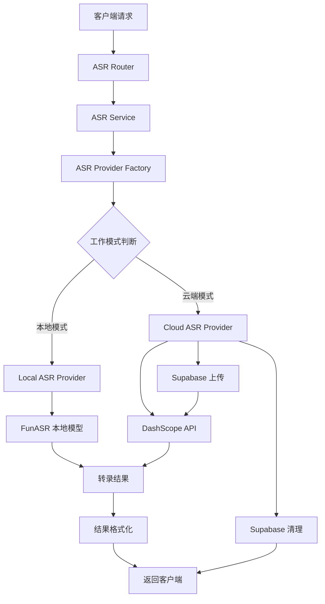
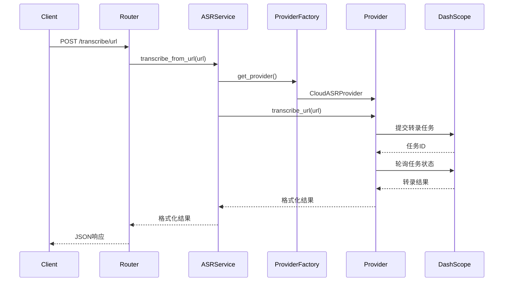
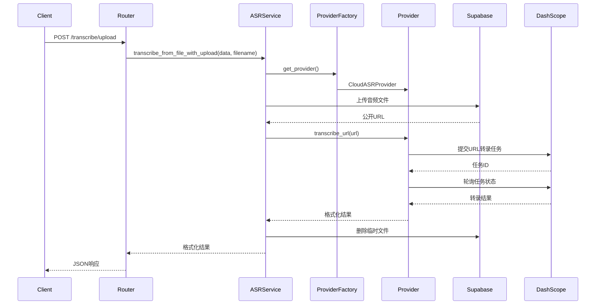

# ASR 服务架构设计文档

## 概述

ASR（Automatic Speech Recognition）服务是 HearSight 项目中的核心音频处理模块，负责将音频文件转换为文本内容。该服务采用双模式架构，支持本地处理和云端处理两种工作模式。

## 架构设计

### 核心组件

ASR 服务由以下核心组件构成：

- **ASRService**: 核心服务类，提供三种主要的转录方法
- **ASRProvider**: 抽象提供者接口，定义了统一的ASR服务接口
- **LocalASRProvider**: 本地ASR提供者实现，使用FunASR本地模型
- **CloudASRProvider**: 云端ASR提供者实现，使用DashScope API
- **ASRProviderFactory**: 提供者工厂类，根据配置创建对应的提供者实例
- **配置管理**: 基于 Pydantic 的环境变量配置系统
- **外部服务集成**: DashScope API 和 Supabase 存储服务

### 服务方法

ASR 服务提供三种主要的音频转录方法：

1. **transcribe_from_url()**: 直接从 URL 转录音频
2. **transcribe_from_bytes()**: 从字节流转录音频（本地模式）
3. **transcribe_from_file_with_upload()**: 上传文件到云端后转录（云端模式）

## 组件关系图



## 数据流设计

### URL 转录流程



### 文件上传转录流程



## 与其他模块的关系

### HearSight 项目架构

ASR 服务是 HearSight 项目中的音频处理核心，与以下模块存在依赖关系：

- **backend**: 主后端服务，负责用户管理和业务逻辑
- **frontend**: 前端界面，提供用户交互
- **ASRBackend**: 独立的 ASR 处理后端，提供专门的音频转录服务

### 数据流向

```text
Frontend -> Backend -> ASRBackend -> External Services
    ↑           ↑           ↑
    └───────────┴───────────┘
        结果返回路径
```

## 设计决策

### 双模式架构

- **本地模式**: 适合对隐私要求高、延迟敏感的场景
- **云端模式**: 适合大规模处理、复杂音频的场景

### 资源管理策略

- **临时文件清理**: 云端模式下，转录完成后自动删除Supabase中的临时音频文件，避免存储成本积累
- **文件名简化**: 转录场景不需要复杂的文件名映射，直接使用UUID命名，简化代码逻辑

### 安全性考虑

- **文件隔离**: 每个转录任务使用独立的UUID文件名，确保文件不会冲突
- **访问控制**: 通过Supabase公开URL提供临时访问，转录完成后立即清理