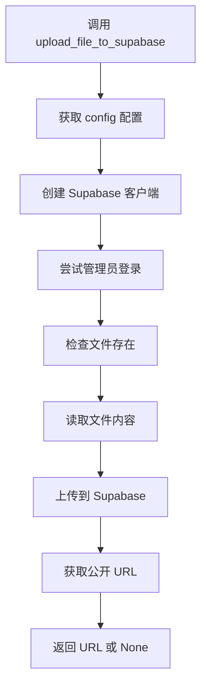

# Supabase 文件上传工具设计文档

## 概述

我设计了 `supabase_upload.py` 模块，作为 HearSight 后端项目中专门处理文件上传到 Supabase 存储的工具。这个模块封装了 Supabase 客户端的创建、管理员登录和文件上传逻辑，简化了其他模块的使用。

## 设计思路

### 核心功能

- 提供 `upload_file_to_supabase` 函数，支持上传本地文件到 Supabase 存储桶
- 自动处理管理员邮箱登录，确保有权限进行上传操作
- 返回公开访问 URL，便于后续使用

### 配置依赖

模块依赖 `config.py` 中的 Supabase 配置，包括 URL、密钥、存储桶名称等。这确保了配置的集中管理和环境变量覆盖。

### 错误处理

- 检查配置完整性
- 验证文件存在性
- 处理登录和上传异常，不中断程序运行

## 架构关系

这个模块与 HearSight 项目其他部分的关系如下：

- **与 config.py**：依赖配置获取 Supabase 参数
- **与 ASRBackend**：ASR 服务可能使用此模块上传音频文件进行处理
- **与前端**：上传的文件 URL 可用于前端展示或下载

## 流程图



## 使用示例

在其他模块中导入并使用：

```python
from supabase_utils.supabase_upload import upload_file_to_supabase

url = upload_file_to_supabase("path/to/file.mp3")
if url:
    print(f"文件上传成功: {url}")
```

这个设计保持了模块的简洁性和可复用性，同时确保了安全性通过管理员登录。
