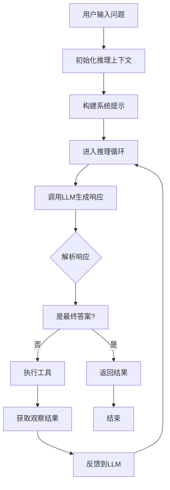

# ReAct 设计文档

## 概述

ReAct（Reasoning + Acting）是一个基于推理和行动范式的智能代理框架，旨在通过交替进行推理和工具调用来解决复杂问题。该框架采用模块化设计，支持流式响应、工具集成和错误处理。

## 架构设计

ReAct框架采用分层架构，主要分为以下层次：

1. **应用层**：BaseAgent类，提供统一的Agent接口
2. **核心层**：ReactLoop类，实现ReAct推理循环逻辑
3. **工具层**：ToolManager和ActionExecutor，管理工具调用
4. **基础设施层**：LLMClient和MCP协议，支持模型调用和工具服务

## 核心组件

### BaseAgent

通用ReAct Agent基类，提供：

- 工具管理和配置
- 推理循环控制
- 流式和非流式响应支持
- 统一的接口抽象

### ReactLoop

ReAct推理循环的核心实现：

- 管理完整的推理流程
- 处理LLM响应解析
- 协调工具执行
- 支持流式输出

### ToolManager

工具管理模块：

- 通过MCP协议连接工具后端
- 动态加载和管理工具
- 生成工具描述和配置

### ActionExecutor

动作执行器：

- 执行外部工具调用
- 处理内置动作（如finish）
- 统一错误处理

### LLMClient

LLM调用客户端：

- 封装OpenAI API调用
- 支持流式和非流式模式
- 统一的接口抽象

## 工作流程

## 与其他模块的关系

### 与backend模块的关系

- ReAct作为backend的核心AI能力模块
- 通过MCP协议与tools模块集成
- 为routers提供Agent服务接口
- 与services模块协作处理业务逻辑

### 与tools模块的关系

- tools模块提供具体的工具实现
- 通过MCP服务器暴露工具接口
- ReAct通过ToolManager动态发现和调用工具

### 与frontend模块的关系

- frontend通过API调用ReAct服务
- 支持流式响应，提升用户体验
- 提供工具调用和推理过程的可视化

## 扩展性

### 工具扩展

- 通过MCP协议支持动态工具注册
- 工具配置通过JSON文件管理
- 支持权限控制和工具过滤

### 模型扩展

- LLMClient抽象层支持不同模型提供商
- 统一的接口便于切换模型
- 支持自定义提示构建器

### 推理策略扩展

- ReactLoop支持自定义推理循环逻辑
- 可扩展内置动作类型
- 支持插件化的解析器和执行器

## 配置和部署

### 环境配置

- 支持多种LLM服务提供商
- 可配置工具后端URL
- 灵活的工具权限管理

### 性能优化

- 流式响应减少延迟
- 异步处理提高并发性
- 缓存机制优化工具调用

## 未来规划

- 支持多Agent协作
- 增强推理追踪和分析
- 集成更多工具类型
- 优化性能和稳定性
