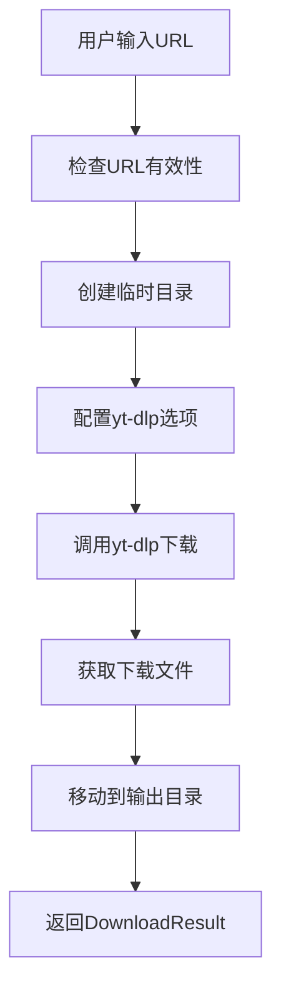

# 小宇宙播客下载器设计文档

## 概述

小宇宙播客下载器是 HearSight 项目中的音频下载模块，专门用于从小宇宙平台下载播客音频内容。该模块基于 yt-dlp 库实现，支持进度回调和错误处理。

## 架构设计

下载器采用单例模式，确保全局只有一个下载器实例。核心组件包括：

- XiaoyuzhouDownloader 类：主要下载逻辑
- DownloadResult 数据类：下载结果封装
- 进度回调机制：实时反馈下载进度

## 与其他模块的关系

- **视频下载模块**：位于 `vedio_download` 目录下的 bilibili 和 youtube 下载器，与本模块并列。视频下载器下载视频和音频分离，而本模块仅下载音频。
- **配置模块**：依赖 `backend/config.py` 中的设置，如下载目录。
- **yt-dlp 库**：外部依赖，用于实际下载。

## 数据流



## 设计原则

- 模块化：下载逻辑与接口分离
- 可扩展：支持未来添加更多音频平台
- 错误处理：完善的异常捕获和日志记录
- 性能：使用临时目录避免磁盘占用

## 输出内容

下载器将音频文件保存到 `download_results` 目录下。输出包括：

- 音频文件：.m4a 或 .mp3 格式
- DownloadResult 对象：包含音频路径、标题、时长、媒体类型等信息

例如：

- 标题: 当生命迎来重大转折，我们该去往何方
- 媒体类型: audio
- 音频路径: download_results/当生命迎来重大转折我们该去往何方.m4a
- 时长: 899.91秒

## 使用示例

结合 `interfaces.py` 中的 `DownloadResult` 类，以下是使用下载器的示例：

```python
from xiaoyuzhou_downloader import download_xiaoyuzhou_episode
from ..interfaces import DownloadResult

def test_download():
    test_url = "https://www.xiaoyuzhoufm.com/episode/6912fcf821e6d1bd34f78257"

    def progress_callback(progress):
        print(f"进度: {progress['status']} - {progress['progress_percent']:.1f}%")

    print("开始测试下载...")
    result = download_xiaoyuzhou_episode(test_url, progress_callback)

    if result.success:
        print("下载成功！")
        print(f"标题: {result.title}")
        print(f"音频路径: {result.audio_path}")
        print(f"时长: {result.duration}秒")
    else:
        print(f"下载失败: {result.error_message}")

if __name__ == "__main__":
    test_download()
```

此示例参考了 bilibili 下载器的使用方式，展示了如何调用下载函数并处理结果。

### DownloadResult 数据结构

`DownloadResult` 是一个数据类，包含以下字段：

- `video_path`: 视频文件路径 (可选)
- `audio_path`: 音频文件路径 (可选)
- `title`: 媒体标题 (可选)
- `duration`: 媒体时长 (秒，可选)
- `media_type`: 媒体类型，如 "video", "audio", "both" (可选)
- `success`: 是否成功 (bool)
- `error_message`: 错误信息 (可选)

### 回调函数参数说明

`progress_callback` 函数接收一个字典参数 `progress`，包含以下键值：

- `status`: 下载状态，如 'downloading', 'finished' 等
- `progress_percent`: 下载进度百分比 (0-100)
- `downloaded_bytes`: 已下载字节数
- `total_bytes`: 总字节数
- `speed`: 下载速度 (字节/秒)
- `eta`: 预计剩余时间 (秒)
- `filename`: 当前下载的文件名
