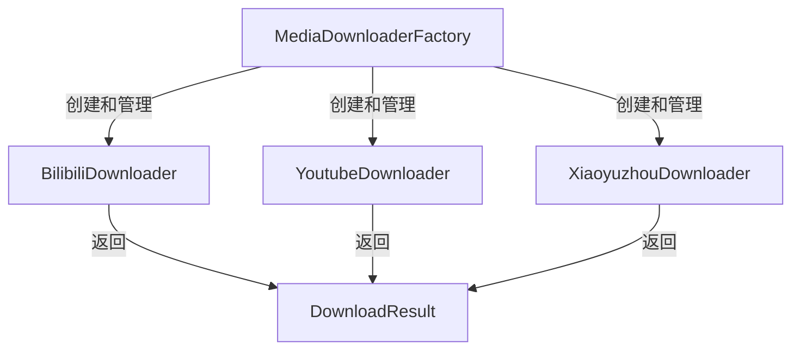
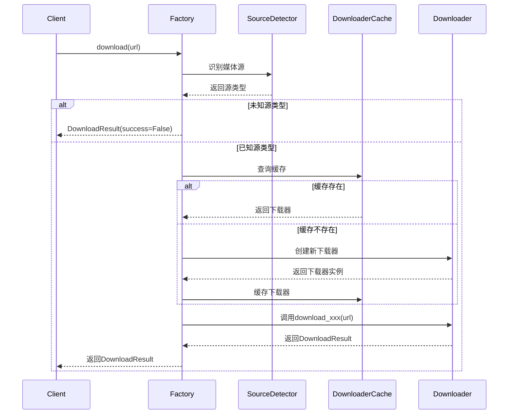

# MediaDownloaderFactory 设计文档

## 概述

MediaDownloaderFactory 是媒体下载模块的核心工厂类，采用工厂模式封装多个媒体源的下载器实现，提供统一的下载接口和自动化的源识别机制。

## 架构设计

### 模块结构

```
media_file_download/
├── common_interfaces.py          # 通用接口定义 (DownloadResult)
├── downloader_factory.py         # 工厂实现
├── audio_download/
│   └── download_xiaoyuzhou/      # 小宇宙播客下载器
├── vedio_download/
│   ├── download_bilibili/        # B站视频下载器
│   └── download_youtube/         # YouTube视频下载器
└── docs/
    └── downloader_factory_design.md
```

### 类间关系



## 设计思路

### 工厂模式

工厂类通过以下方式实现工厂模式：

1. **统一接口**：所有下载器都通过工厂访问，外部不直接实例化各个下载器
2. **自动识别**：根据URL自动识别媒体源类型，选择合适的下载器
3. **缓存管理**：缓存已创建的下载器实例，避免重复创建，提高效率
4. **便捷方法**：提供快捷方法供知道媒体源的场景使用

### URL识别机制

使用正则表达式映射来识别不同媒体源：

| 媒体源 | 模式 | 支持的URL示例 |
|--------|------|--------------||
| bilibili | `(?:https?://)?(?:www\.)?bilibili\.com` | bilibili.com/video/BVxxx |
| youtube | `(?:https?://)?(?:www\.)?(?:youtube\.com\|youtu\.be)` | youtube.com/watch?v=xxx |
| xiaoyuzhou | `xiaoyuzhoufm\.com` | xiaoyuzhoufm.com/episode/xxx |

## 核心功能

### 初始化

```python
factory = MediaDownloaderFactory(output_dir="/path/to/output", need_login=False)
```

参数说明：

- `output_dir`：下载文件输出目录，各下载器独立使用
- `need_login`：是否需要登录，仅影响 B站 和 YouTube 下载器

### 通用下载接口

```python
result = factory.download(url, progress_callback=None)
```

工作流程：

1. 识别URL对应的媒体源类型
2. 获取或创建对应的下载器实例
3. 调用下载器的下载方法
4. 返回统一的 DownloadResult 对象

### 快捷下载接口

针对已知媒体源的场景：

```python
result = factory.download_bilibili(url, progress_callback=None)
result = factory.download_youtube(url, progress_callback=None)
result = factory.download_xiaoyuzhou(url, progress_callback=None)
```

## 下载流程



## 数据结构

### DownloadResult

通用下载结果数据结构：

```python
@dataclass
class DownloadResult:
    video_path: Optional[str] = None      # 视频文件路径
    audio_path: Optional[str] = None      # 音频文件路径
    title: Optional[str] = None           # 媒体标题
    duration: Optional[float] = None      # 时长（秒）
    media_type: Optional[str] = None      # 媒体类型 ("video", "audio", "both")
    success: bool = False                 # 下载是否成功
    error_message: Optional[str] = None   # 错误信息
```

## 使用示例

### 场景 1：自动识别下载

```python
from media_file_download import MediaDownloaderFactory

factory = MediaDownloaderFactory()

# 自动识别B站URL并下载
result = factory.download("https://www.bilibili.com/video/BV1arCTBSEnP")
if result.success:
    print(f"标题: {result.title}")
    print(f"视频路径: {result.video_path}")
    print(f"音频路径: {result.audio_path}")
```

**实际输出示例**:
```
下载成功！
标题: 7.6K Star 开源神器！FileCodeBox 替代网盘，免注册免客户端，浏览器传文件超方便
视频路径: vedio_download/download_bilibili/download_results/76K Star 开源神器FileCodeBox 替代网盘免注册免客户端浏览器传文件超方便.mp4
音频路径: vedio_download/download_bilibili/download_results/76K Star 开源神器FileCodeBox 替代网盘免注册免客户端浏览器传文件超方便.m4a
```

### 场景 2：YouTube下载

```python
factory = MediaDownloaderFactory()

result = factory.download("https://www.youtube.com/watch?v=E80ZVZNiO64")
if result.success:
    print(f"标题: {result.title}")
    print(f"视频路径: {result.video_path}")
    print(f"音频路径: {result.audio_path}")
```

**实际输出示例**:

```text
下载成功！
标题: ICE to step up operations in NYC, Tom Homan says
视频路径: vedio_download/download_youtube/download_results/ICE to step up operations in NYC Tom Homan says.mp4
音频路径: vedio_download/download_youtube/download_results/ICE to step up operations in NYC Tom Homan says.m4a
```

### 场景 3：小宇宙播客下载

```python
factory = MediaDownloaderFactory()

result = factory.download("https://www.xiaoyuzhoufm.com/episode/6912fcf821e6d1bd34f78257")
if result.success:
    print(f"标题: {result.title}")
    print(f"音频路径: {result.audio_path}")
```

**实际输出示例**:

```text
下载成功！
标题: 当生命迎来重大转折，我们该去往何方
音频路径: audio_download/download_xiaoyuzhou/download_results/当生命迎来重大转折我们该去往何方.m4a
```

### 场景 4：进度回调

```python
def progress_callback(info):
    if info['status'] == 'downloading':
        percent = info.get('_percent_str', 'N/A')
        print(f"进度: {percent}")
    elif info['status'] == 'finished':
        print("下载完成")

result = factory.download(
    "https://www.bilibili.com/video/BV1arCTBSEnP",
    progress_callback=progress_callback
)
```

## 与其他模块的关系

- **common_interfaces.py**：定义了统一的结果数据结构
- **各下载器模块**：工厂负责实例化和管理各下载器
- **外部调用方**：通过工厂提供的接口访问下载功能
