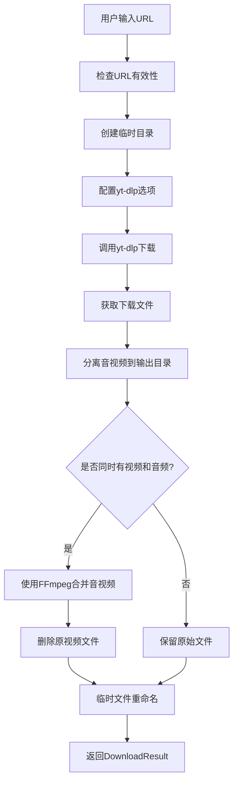

# b站视频下载器设计文档

## 概述

b站视频下载器是 HearSight 项目中的视频下载模块，专门用于从 bilibili 平台下载视频内容。该模块基于 yt-dlp 库实现，支持视频和音频分离下载，进度回调和错误处理。

## 架构设计

下载器采用单例模式，确保全局只有一个下载器实例。核心组件包括：

- BilibiliDownloader 类：主要下载逻辑
- DownloadResult 数据类：下载结果封装
- 进度回调机制：实时反馈下载进度

## 与其他模块的关系

- **音频下载模块**：位于 `audio_download` 目录下的 xiaoyuzhou 下载器，与本模块并列。音频下载器仅下载音频，而本模块下载视频和音频分离。
- **其他视频下载器**：如 youtube 下载器，功能类似。
- **配置模块**：依赖 `backend/config.py` 中的设置。
- **yt-dlp 库**：外部依赖，用于实际下载。

## 数据流



## 设计原则

- 模块化：下载逻辑与接口分离
- 可扩展：支持未来添加更多视频平台
- 错误处理：完善的异常捕获和日志记录
- 性能：使用临时目录避免磁盘占用

## 输出内容

下载器将视频和音频文件保存到 `download_results` 目录下。处理流程如下：

1. yt-dlp 下载视频和音频到临时目录（分离状态，视频.mp4 和音频.m4a）
2. 将两个文件移动到输出目录
3. 使用 FFmpeg 合并成单一 MP4 文件
4. 合并后的 MP4 包含视频和音频两个轨道

最终输出包括：

- 视频文件：.mp4 格式（包含视频和音频轨道）
- 音频文件：.m4a 格式（原始分离音频的备份）
- DownloadResult 对象：包含视频路径、音频路径、标题、时长、媒体类型等信息

**实际输出示例**：

```text
下载成功！
标题: 7.6K Star 开源神器！FileCodeBox 替代网盘，免注册免客户端，浏览器传文件超方便
视频路径: download_results/76K Star 开源神器FileCodeBox 替代网盘免注册免客户端浏览器传文件超方便.mp4
音频路径: download_results/76K Star 开源神器FileCodeBox 替代网盘免注册免客户端浏览器传文件超方便.m4a
```

### 音视频合并细节

合并过程使用 FFmpeg 的流复制（stream copy）模式，保证质量无损且速度快：

- 视频流直接复制（`-c:v copy`），无重新编码
- 音频流直接复制（`-c:a copy`），保持原有质量
- 使用临时文件 `_merged.mp4` 避免文件占用冲突
- 合并成功后替换原视频文件

**合并流程日志**：

```text
开始合并音视频...
音视频合并成功: download_results/76K Star 开源神器FileCodeBox 替代网盘免注册免客户端浏览器传文件超方便_merged.mp4
```

## 使用示例

结合 `interfaces.py` 中的 `DownloadResult` 类，以下是使用下载器的示例：

```python
from bilibili_downloader import download_bilibili_video
from ..interfaces import DownloadResult

def test_download():
    test_url = "https://www.bilibili.com/video/BV1arCTBSEnP"

    def progress_callback(progress):
        print(f"进度: {progress['status']} - {progress['progress_percent']:.1f}%")

    print("开始测试下载...")
    result = download_bilibili_video(test_url, progress_callback)

    if result.success:
        print("下载成功！")
        print(f"标题: {result.title}")
        print(f"视频路径: {result.video_path}")
        print(f"音频路径: {result.audio_path}")
        print(f"时长: {result.duration}秒")
    else:
        print(f"下载失败: {result.error_message}")

if __name__ == "__main__":
    test_download()
```

此示例展示了如何调用下载函数并处理结果。

### DownloadResult 数据结构

`DownloadResult` 是一个数据类，包含以下字段：

- `video_path`: 视频文件路径 (可选)
- `audio_path`: 音频文件路径 (可选)
- `title`: 媒体标题 (可选)
- `duration`: 媒体时长 (秒，可选)
- `media_type`: 媒体类型，如 "video", "audio", "both" (可选)
- `success`: 是否成功 (bool)
- `error_message`: 错误信息 (可选)

### 回调函数参数说明

`progress_callback` 函数接收一个字典参数 `progress`，包含以下键值：

- `status`: 下载状态，如 'downloading', 'finished' 等
- `progress_percent`: 下载进度百分比 (0-100)
- `downloaded_bytes`: 已下载字节数
- `total_bytes`: 总字节数
- `speed`: 下载速度 (字节/秒)
- `eta`: 预计剩余时间 (秒)
- `filename`: 当前下载的文件名
