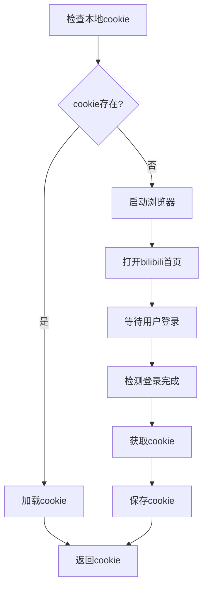

# b站登录设计文档

## 概述

b站登录模块是 HearSight 项目中b站视频下载器的登录子模块，专门用于获取bilibili平台的登录凭证（cookie）。该模块基于 Playwright 浏览器自动化库实现，支持扫码登录和账号密码登录。

## 架构设计

登录模块采用独立的处理类，确保登录逻辑与下载逻辑分离。核心组件包括：

- `bilibili_cookie_handler.py`：cookie处理模块
- Cookie持久化机制：自动保存和加载cookie
- 浏览器自动化：基于Playwright的登录流程

## 登录流程



## 登录机制

### 自动检测登录完成

系统通过以下方式检测用户是否完成登录：

1. **页面加载状态检测**：等待页面达到 `networkidle` 状态
2. **超时机制**：5分钟超时，避免无限等待
3. **Cookie验证**：检查是否获取到有效的bilibili登录cookie

### 反自动化检测与伪装策略

由于网站可能检测到自动化浏览器并阻止登录流程，我们在登录模块中增加了若干伪装措施以降低被检测的概率：

- 启动参数：在 chromium.launch 中加入 `--disable-blink-features=AutomationControlled` 以屏蔽部分自动化特征。
- 浏览器上下文设置：设置真实的 user_agent（常见 Chrome UA）、合理的 viewport（1920x1080）。
- 注入初始化脚本（page.add_init_script）：重写 navigator.webdriver 为 false，伪造 navigator.plugins 和 navigator.languages 等特征。
- 轮询URL：通过轮询 page.url 来检测登录是否完成，避免因多次跳转或中间页导致的误判。

注意：这些伪装不能保证100%通过，如果仍然被判定为不安全，请参考“更稳妥的通过方式”部分，使用 user_data_dir 或手动导入 cookie。

### Cookie持久化

- **存储位置**：`datas/bilibili_cookies.json`
- **格式**：JSON格式，保存为列表，每个元素为cookie对象（包括name, value, domain, path, secure, expires）。
- **expires 字段说明**：expires 是 Unix 时间戳（秒数），表示 cookie 过期时间。要转换为北京时间，可以使用 Python 命令：`python -c "import datetime; print(datetime.datetime.fromtimestamp(1779122566.033824, tz=datetime.timezone(datetime.timedelta(hours=8))))"`，其中 1779122566.033824 是示例时间戳。
- **安全性**：本地存储，仅用于API调用

建议：对于 `yt-dlp`，优先将 cookie 导出为 Netscape 格式的 cookies.txt 文件（或使用 `--cookies-from-browser`），并通过 `cookiefile` 参数或 `--cookies` 来使用，而不是直接将 Cookie 作为 HTTP Header 传递。导出为文件可以和 `yt-dlp` 的 `cookiefile` 参数更好兼容，且安全性更高。

## 与下载模块的集成

登录模块通过以下方式与下载模块集成：

1. **初始化时获取**：在 `BilibiliDownloader` 初始化时获取cookie
2. **异常处理**：登录失败时抛出异常，提前发现问题
3. **自动重用**：已保存的cookie自动加载，无需重复登录

### 在未设置登录时也尽量使用已保存cookie

为了提高下载在需要登录才能访问视频时的成功率，下载器现在会在任何情况下尝试加载本地保存的 cookie。行为如下：

- 如果 `need_login=True`：优先尝试加载本地 cookie，如果未找到则启动浏览器进行登录以获取 cookie；如果登录失败则抛出异常。
- 如果 `need_login=False`：会尝试加载本地 cookie（如果存在则使用），如果未找到保存的 cookie，则以内匿名用户身份进行下载。

这样可以避免在不需要强制登录时反复打开浏览器，但如果本地有可用 cookie，会被自动利用来访问受限资源。

## 设计原则

- **用户友好**：简化的登录流程，用户只需扫码或输入账号密码
- **自动化**：最大程度减少用户操作，自动检测登录状态
- **安全性**：本地存储cookie，不涉及服务器端保存
- **容错性**：完善的异常处理和日志记录

## 使用示例

### 基本使用

```python
from bilibili_downloader import BilibiliDownloader

# 需要登录的下载器
downloader = BilibiliDownloader(need_login=True)
result = downloader.download_video(url)
```

### 手动获取cookie

```python
from bilibili_cookie_handler import login_and_get_cookies_sync

# 手动获取cookie
cookies = login_and_get_cookies_sync()
if cookies:
    print("登录成功")
```

## 依赖项

- **Playwright**：浏览器自动化库
- **asyncio**：异步编程支持
- **pathlib**：路径处理
- **json**：数据序列化

## 注意事项

1. **浏览器权限**：确保系统允许Playwright启动浏览器
2. **网络环境**：登录过程需要稳定的网络连接
3. **Cookie有效期**：bilibili cookie有过期时间，需要定期重新登录
4. **并发限制**：避免同时运行多个登录实例
