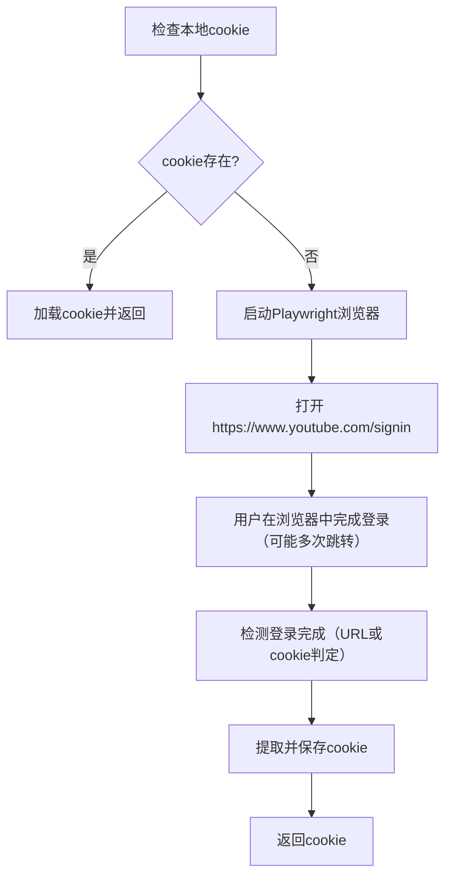

# YouTube 登录设计文档

## 概述

YouTube 登录模块用于为 HearSight 项目中 YouTube 下载器获取登录凭证（cookie）。此模块基于 Playwright 实现，目标是尽量兼容 Google 的多步骤登录流程（账号、密码、验证码、二步验证等），并尽可能绕过自动化检测。文档基于文件 `youtube_cookie_handler.py` 的实现。

## 架构设计

- `youtube_cookie_handler.py`：核心 cookie 处理模块，提供加载、保存、以及通过 Playwright 登录并获取 cookie 的能力。
- Cookie 持久化：`datas/youtube_cookies.json`。
- 与下载器集成：`YoutubeDownloader` 在初始化时可选择加载或获取 cookie，下载过程通过将 cookie 注入到 HTTP Header（Cookie）中来带上登录状态。

## 登录流程



## 登录机制

### 自动检测登录完成

系统采用多种手段判断登录是否成功：

1. URL 检查：持续轮询 `page.url`，当 URL 包含 `youtube.com` 且不含 `signin` 时，判断为成功登陆（兼容 Google 多次重定向）。
2. 超时保护：默认总超时时间为 10 分钟，检查间隔 2 秒。超时后会尝试获取已存在的 cookie，但仍可能失败。
3. Cookie 验证：最终会通过 `page.context.cookies()` 获取 cookie 列表并检查是否包含有效的登录 cookie。

### 反自动化检测与伪装策略

Google 对自动化浏览器有较严格的检测策略，因此在 `youtube_cookie_handler.py` 中采用了以下策略以减少被识别风险：

- 启动参数：在 `chromium.launch` 中加入 `--disable-blink-features=AutomationControlled`。
- 浏览器上下文设置：设置真实的 `user_agent`（常见 Chrome UA 字符串）和合理 `viewport`（1920x1080）。
- 注入初始化脚本（`page.add_init_script`）：重写 `navigator.webdriver` 为 false，并伪造 `navigator.plugins`、`navigator.languages` 等。
- 使用可见浏览器（headless=False）以提高成功率。

注意：这些伪装不能保证百分之百成功。若 Google仍拒绝登录，需要使用下列更稳妥手段。

## 更稳妥的通过方式（建议）

- 使用真实 Chrome 的 `user_data_dir`（复用系统 Chrome 配置），或指定 `executable_path` 使用本地 Chrome 可执行文件，直接复用已登录的用户会话。
- 手动登录并导出 cookie，之后把 cookie 存入 `datas/youtube_cookies.json`，脚本直接加载使用。
- 使用 Playwright 社区的 stealth 插件或更完整的 stealth 注入脚本（例如隐藏 WebGL、平台信息、mediaCapabilities 等）。

## Cookie 持久化

- 存储位置：`datas/youtube_cookies.json`（位于 `download_youtube/datas`）
- 存储格式：JSON，保存为列表（cookie 对象数组），每项包含 name, value, domain, path, secure, expires。
- 过期时间处理：当cookie的expires字段为None或负数时，会被转换为9999999999（永久有效），避免yt-dlp的警告。
- 接口：提供 `load_cookies()`、`save_cookies()` 方法，用于读取和写入 cookie 文件。

建议：对于 `yt-dlp`，优先导出为 Netscape 格式的 `cookies.txt` 文件并通过 `cookiefile` 参数或 `--cookies` 使用，而不是把 cookie 作为 HTTP Header 传递。这样兼容性更好，也避免 yt-dlp 的弃用警告。

## 与下载模块的集成

`YoutubeDownloader` 集成方式与 Bilibili 相似：

- 在初始化时，通过 `need_login` 参数控制是否需要登录。
- 如果 `need_login=True`，优先尝试 `load_cookies()` 加载本地 cookie，如果未找到则调用 `login_and_get_cookies_sync()` 进行 Playwright 登录获取并保存 cookie。
- 下载时把 cookie 字典拼接成 `Cookie` header，例如 `key1=value1; key2=value2`，然后设置在 `yt-dlp` 的 `ydl_opts['http_headers']` 中，添加 `User-Agent` 模拟正常浏览器请求。

### 在未设置登录时也尽量使用已保存cookie

为了提高下载在需要登录才能访问视频时的成功率，下载器在任何情况下都会尝试加载并使用本地保存的 cookie。行为如下：

- 如果 `need_login=True`：优先尝试加载本地 cookie，如果未找到则通过 Playwright 登录获取 cookie；若登录失败则抛出异常。
- 如果 `need_login=False`：仍尝试加载本地 cookie（若存在会被使用），否则以内匿名用户身份进行下载。

这样可以避免不必要的登录操作，但在能利用到已有 cookie 的场景下，下载器会自动使用这些 cookie 来提高下载命中率。

## 依赖项

- Playwright：用于浏览器自动化，登录并提取 cookie。
- asyncio：用于异步执行 Playwright 登录流程。
- pathlib、json：用于 cookie 持久化和路径处理。
- yt-dlp：下载器（集成 cookie 时使用 HTTP Header）。

## 安全与隐私

- cookie 存储在本地，不上传或共享给远端。需要在本机安全存放该文件。
- cookie 具有有效期，请注意定期重新登录以更新 cookie。

## 使用示例

- 自动加载或登录获取 cookie 并下载：

```python
from youtube_downloader import YoutubeDownloader

# 需要登录
yd = YoutubeDownloader(need_login=True)
result = yd.download_video('https://www.youtube.com/watch?v=xxx')
```

- 手动获取 cookie（用于测试）：

```bash
python test_cookie_handler.py
# 使用 headless=False 手动在浏览器登录
```

- 手动保存 cookie 后，让下载器直接加载：

```python
from youtube_downloader import YoutubeDownloader

yd = YoutubeDownloader(need_login=True)  # 载入已保存的 cookie
```

## 测试说明

- `test_cookie_handler.py`：测试登录并获取 cookie 文件，适合手动场景。设置 `headless=False` 之后运行脚本，在本地真实浏览器窗口里完成登录。
- 如果出现 google 的“无法登录，该浏览器或应用可能不安全”的提示，建议手动登录并导出 cookie 或使用 `user_data_dir` 复用系统 Chrome 会话。

## 注意事项

- headless 模式更容易触发 Google 的自动化检测，建议在测试登录时使用 `headless=False`。
- Google 登录流程可能包括验证码/二步验证/设备信任等步骤，脚本需支持轮询 URL 而不是单次重定向判断。
- 在不同地区和网络环境下，Google 的策略可能差异明显，务必保证网络稳定并考虑使用 `user_data_dir` 方案。

