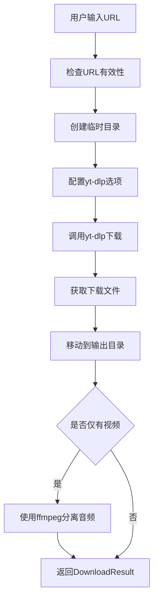

# YouTube视频下载器设计文档

## 概述

YouTube视频下载器是 HearSight 项目中的视频下载模块，专门用于从 YouTube 平台下载视频内容。该模块基于 yt-dlp 库实现，支持视频和音频分离下载，进度回调和错误处理。

## 架构设计

下载器采用单例模式，确保全局只有一个下载器实例。核心组件包括：

- YoutubeDownloader 类：主要下载逻辑
- DownloadResult 数据类：下载结果封装
- 进度回调机制：实时反馈下载进度
- 音频分离机制：当yt-dlp未成功分离音频时，使用ffmpeg强制分离

## 与其他模块的关系

- **音频下载模块**：位于 `audio_download` 目录下的 xiaoyuzhou 下载器，与本模块并列。音频下载器仅下载音频，而本模块下载视频和音频分离。
- **其他视频下载器**：如 bilibili 下载器，功能类似。
- **配置模块**：依赖 `backend/config.py` 中的设置。
- **yt-dlp 库**：外部依赖，用于实际下载。

## 数据流



## 设计原则

- 模块化：下载逻辑与接口分离
- 可扩展：支持未来添加更多视频平台
- 错误处理：完善的异常捕获和日志记录
- 性能：使用临时目录避免磁盘占用

## 输出内容

下载器将视频和音频文件保存到 `download_results` 目录下。输出包括：

- 视频文件：.mp4 格式
- 音频文件：.m4a 格式（如果yt-dlp未分离则使用ffmpeg自动分离）
- DownloadResult 对象：包含视频路径、音频路径、标题、时长、媒体类型等信息

### 音频分离机制

下载器采用分阶段的音频获取策略：

1. **第一阶段**：yt-dlp 下载视频文件（通常包含音频轨道）
2. **第二阶段**：检测下载结果，如果只有视频文件，自动使用 ffmpeg 从视频中提取音频流
3. **提取方式**：使用 `ffmpeg -y -i video.mp4 -vn -acodec copy -loglevel error audio.m4a`
   - `-vn`: 不处理视频流
   - `-acodec copy`: 直接复制音频流不重新编码，速度快质量无损
   - `-y`: 自动覆盖已存在文件
   - `-loglevel error`: 仅输出错误信息
4. **结果**：确保下载完成后总是同时拥有视频和音频文件

**注意**：ffmpeg 提取音频时不会修改原视频文件，原视频仍然包含音频轨道。这样可以同时拥有带音频的视频和单独的音频文件，便于后续处理。

**实际执行示例**：

```text
[DEBUG] 检测到仅有视频无音频，准备提取音频
[DEBUG] 删除已存在的音频文件: download_results/video.m4a
[DEBUG] 执行ffmpeg命令: ffmpeg -y -i video.mp4 -vn -acodec copy -loglevel error audio.m4a
[DEBUG] ffmpeg 正在运行...
[DEBUG] ffmpeg 完成，返回码: 0
[DEBUG] 音频提取成功: download_results/video.m4a
```

## 使用示例

结合 `interfaces.py` 中的 `DownloadResult` 类，以下是使用下载器的示例：

```python
from youtube_downloader import download_youtube_video
from ..interfaces import DownloadResult

def test_download():
    test_url = "https://www.youtube.com/watch?v=E80ZVZNiO64"

    def progress_callback(progress):
        print(f"进度: {progress['status']} - {progress['progress_percent']:.1f}%")

    print("开始测试下载...")
    result = download_youtube_video(test_url, progress_callback)

    if result.success:
        print("下载成功！")
        print(f"标题: {result.title}")
        print(f"视频路径: {result.video_path}")
        print(f"音频路径: {result.audio_path}")
        print(f"时长: {result.duration}秒")
    else:
        print(f"下载失败: {result.error_message}")

if __name__ == "__main__":
    test_download()
```

此示例展示了如何调用下载函数并处理结果。

### DownloadResult 数据结构

`DownloadResult` 是一个数据类，包含以下字段：

- `video_path`: 视频文件路径 (可选)
- `audio_path`: 音频文件路径 (可选)
- `title`: 媒体标题 (可选)
- `duration`: 媒体时长 (秒，可选)
- `media_type`: 媒体类型，如 "video", "audio", "both" (可选)
- `success`: 是否成功 (bool)
- `error_message`: 错误信息 (可选)

### 回调函数参数说明

`progress_callback` 函数接收一个字典参数 `progress`，包含以下键值：

- `status`: 下载状态，如 'downloading', 'finished' 等
- `progress_percent`: 下载进度百分比 (0-100)
- `downloaded_bytes`: 已下载字节数
- `total_bytes`: 总字节数
- `speed`: 下载速度 (字节/秒)
- `eta`: 预计剩余时间 (秒)
- `filename`: 当前下载的文件名
