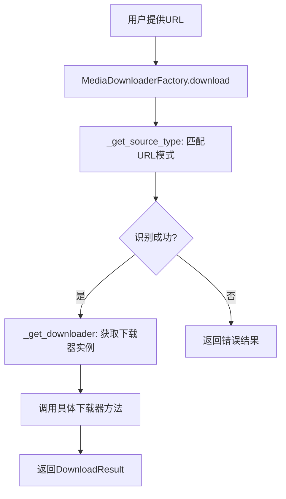

# 媒体下载器工厂设计文档

## 设计思路

媒体下载器工厂采用工厂模式实现，支持根据URL自动识别媒体源类型，并返回对应的下载器实例。该设计旨在提供统一的下载接口，简化不同媒体平台的下载逻辑，同时通过缓存机制提高性能。

## 架构概述

工厂类 `MediaDownloaderFactory` 作为核心组件，负责媒体源识别、下载器实例管理和统一下载接口。抽象基类 `MediaDownloaderBase` 定义了下载器的标准接口，确保各具体下载器的一致性。

## 支持的媒体源

- Bilibili（哔哩哔哩）
- YouTube
- Xiaoyuzhou（小宇宙播客）

## 关键组件

### MediaDownloaderBase

抽象基类，定义 `download` 方法作为下载接口。

### MediaDownloaderFactory

工厂类，包含以下功能：

- URL模式匹配识别媒体源
- 下载器实例缓存
- 统一下载接口
- 特定媒体源的便捷下载方法

## 数据流

## 与其他模块关系

- 依赖 `backend.common_interfaces.DownloadResult` 作为下载结果类型
- 使用具体下载器模块：
  - `audio.download.xiaoyuzhou.xiaoyuzhou_downloader`
  - `video.download.bilibili.bilibili_downloader`
  - `video.download.youtube.youtube_downloader`
- 集成到媒体处理流程中，提供下载服务
