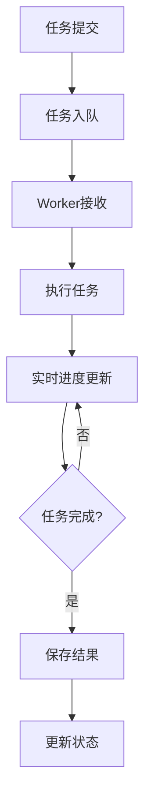

# 队列系统设计文档

## 概述

HearSight项目的队列系统基于Celery实现异步任务处理，支持视频/音频下载、语音识别等长时间运行任务。系统采用Redis作为消息队列和结果后端，提供实时进度反馈机制。

## 架构设计

### 核心组件

1. **Celery Worker**: 任务执行者，负责处理具体的业务逻辑
2. **Redis**: 消息队列、结果存储、进度数据缓存
3. **FastAPI**: 提供任务提交和进度查询的HTTP接口
4. **PostgreSQL**: 持久化存储任务状态和结果

### 技术栈

- **任务队列**: Celery + Redis
- **进度存储**: Redis (键值存储)
- **任务状态**: PostgreSQL
- **API接口**: FastAPI

## 任务流程

### 任务生命周期



### 主要任务类型

- **process_job_task**: 核心任务，处理URL下载或上传文件，进行语音识别

## 进度反馈机制

### 设计原则

1. **实时性**: 任务执行过程中实时更新进度
2. **持久化**: 进度数据存储在Redis中，支持分布式部署
3. **细粒度**: 划分详细的处理阶段，便于前端展示
4. **容错性**: 异常情况下也能提供状态反馈

### 进度数据结构

```python
class ProgressData(TypedDict):
    status: str              # 任务状态: idle/pending/processing/completed/failed
    stage: str              # 处理阶段
    progress_percent: float # 进度百分比 0-100
    filename: str           # 当前处理的文件名
    message: str            # 状态消息
    job_id: int             # 任务ID
    current_bytes: int      # 下载字节数 (可选)
    total_bytes: int        # 总字节数 (可选)
    speed: float            # 下载速度 (可选)
    eta_seconds: int        # 预计剩余时间 (可选)
    error: str              # 错误信息 (可选)
```

### 进度阶段划分

#### 1. 上传文件处理阶段

| 阶段 | 进度 | 说明 |
|------|------|------|
| upload_processing | 10% | 正在处理上传的文件（提取音频等） |
| upload | 100% | 文件上传并处理完成 |

#### 2. 下载阶段

| 阶段 | 进度 | 说明 |
|------|------|------|
| download_start | 0% | 准备开始下载 |
| download | 0-100% | 实时下载进度（通过回调更新） |

#### 3. 语音识别阶段

| 阶段 | 进度 | 说明 |
|------|------|------|
| asr_preprocessing | 5% | 准备语音识别环境 |
| asr_recognizing | 10% | 正在进行语音识别 |
| asr_postprocessing | 80% | 语音识别完成，后处理结果 |
#### 4. 完成阶段
| 阶段 | 进度 | 说明 |
|------|------|------|

#### 5. 错误处理

| 阶段 | 进度 | 说明 |
|------|------|------|
| error | 0% | 任务处理失败 |

## Redis存储设计

### 键命名规范

```
task_progress:{job_id}  # 任务进度数据
celery-task-meta-{task_id}  # Celery任务元数据
```

### 数据格式

```json
{
  "status": "processing",
  "stage": "download",
  "progress_percent": 45.5,
  "filename": "video.mp4",
  "message": "下载中... 45.5%",
  "job_id": 12345,
  "current_bytes": 4500000,
  "total_bytes": 10000000,
  "speed": 50000,
  "eta_seconds": 110
}
```

### 过期策略

- 进度数据设置24小时过期时间
- 避免Redis内存无限增长

Note: 本项目默认优先使用 Celery 的 result backend（settings.celery_result_backend）来存储进度，这通常是 Redis 的不同 DB（如 1），而 Celery 的 broker（settings.celery_broker_url）可能指向另一个 DB（如 0）。请确认所有组件（示例、API、worker）使用同一 Redis URL/DB 来读取写入进度。

## API接口设计

### 提交任务

```http
POST /api/tasks/process
Content-Type: application/json

{
  "url": "https://example.com/video.mp4",
  "job_id": 12345
}
```

### 查询进度

```http
GET /api/progress/task/{job_id}
```

响应示例：
```json
{
  "status": "processing",
  "stage": "asr_recognizing",
  "progress_percent": 25.0,
  "filename": "audio.wav",
  "message": "正在进行语音识别...",
  "job_id": 12345
}
```

## 错误处理

### 异常情况

1. **网络错误**: 下载失败时更新错误状态
2. **文件错误**: 上传文件不存在或格式不支持
3. **ASR错误**: 语音识别服务调用失败
4. **存储错误**: 数据库或Redis连接失败

### 错误进度更新

```python
set_task_progress(job_id, {
    "status": "failed",
    "stage": "error",
    "progress_percent": 0,
    "error": "具体错误信息",
    "message": f"任务处理失败: {error_message}"
})
```


## 部署与运行注意事项

- 代码修改后，必须重启 Celery worker 才能使改动生效。开发环境下，重启 worker 的方式：

```cmd
# Windows cmd 示例
set CELERY_LOG_LEVEL=debug
set CELERY_WORKER_CONCURRENCY=1
python -m backend.queues.worker_launcher
```

- 开发时建议启动 Celery worker，并使用 `example.py` 的 async 提交和进度监控进行验证（保持日志级别为 debug 可观察写入）。示例命令：

```cmd
# 在 backend/queues 目录下运行
python example.py
```

- async 模式需要 worker 运行（并使用相同的 Redis 配置）。

### 常见调试步骤

1. 确认 Redis 服务运行并检查 Celery result backend 与 broker 的 URL:

```cmd
redis-cli ping
redis-cli -n 1 keys "task_progress:*"
redis-cli -n 1 get "task_progress:123"
```

1. 启动 worker 并查看 debug 日志，确认 `set_task_progress` 是否被调用以及写入的 Redis URL 是否正确：

```cmd
set CELERY_LOG_LEVEL=debug
python -m backend.queues.worker_launcher
```

1. 如果进度没有写入：

- 确定 worker 使用的 Redis URL（日志里会打印 progress redis client）
- 确认 download 回调是否触发（较大文件更容易触发）
- 若需要，可以使用 `redis-cli` 手动写入并验证读取

1. 调试便利性：

- 示例脚本 `backend/queues/example.py` 在 async 模式下会输出 Redis URL、测试写入/读取及所有 `task_progress:*` 键，便于定位问题。

