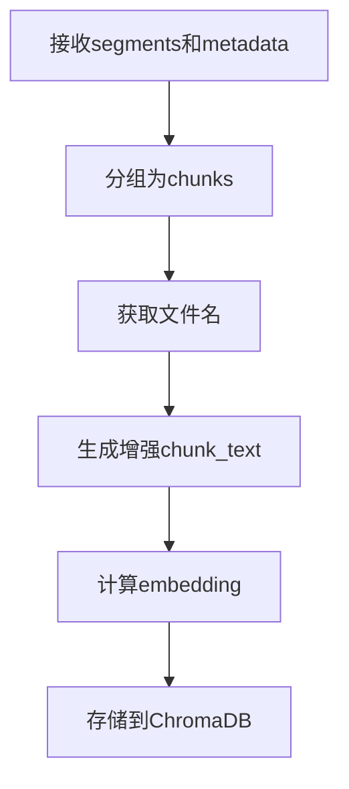

# Embedding文件名增强设计文档

## 引言

当前知识库的embedding环节仅基于文本内容进行向量嵌入，当用户基于文件名提问时，检索效果不佳。本文档提出在embedding时同时加入文件名信息的改进方案，以提升检索准确性。

## 当前问题

在`knowledge_base_service.py`的`add_transcript`方法中，embedding仅基于chunk_text生成，而chunk_text由句子段拼接而成，不包含文件名信息。当用户查询包含文件名相关内容时，向量相似度可能无法有效匹配，导致检索结果不准确。

## 解决方案

在生成embedding时，将文件名与文本内容结合，形成更丰富的上下文信息。具体做法是在chunk_text前添加文件名描述。

## 实现细节

### 修改位置
- 文件：`backend/services/knowledge_base_service.py`
- 方法：`add_transcript`

### 代码修改建议
在生成chunk_text时，添加文件名信息：

```python
# 获取文件名（假设metadata中包含filename字段）
filename = metadata.get("filename", "未知文件")

# 修改chunk_text生成逻辑
chunk_text = f"文件名：{filename}\n内容：{' '.join([seg['sentence'] for seg in chunk])}"
```

### 数据来源
需要确保metadata中包含`filename`字段，可从上传或转写过程中获取。

### 检索优化
在`search_similar`方法中，可考虑对query进行预处理，如果query包含文件名相关信息，则增强query的权重。

## 流程图



## 总结

通过在embedding时加入文件名信息，可以显著提升基于文件名提问的检索效果。该方案实现简单，对现有架构影响最小，值得实施。