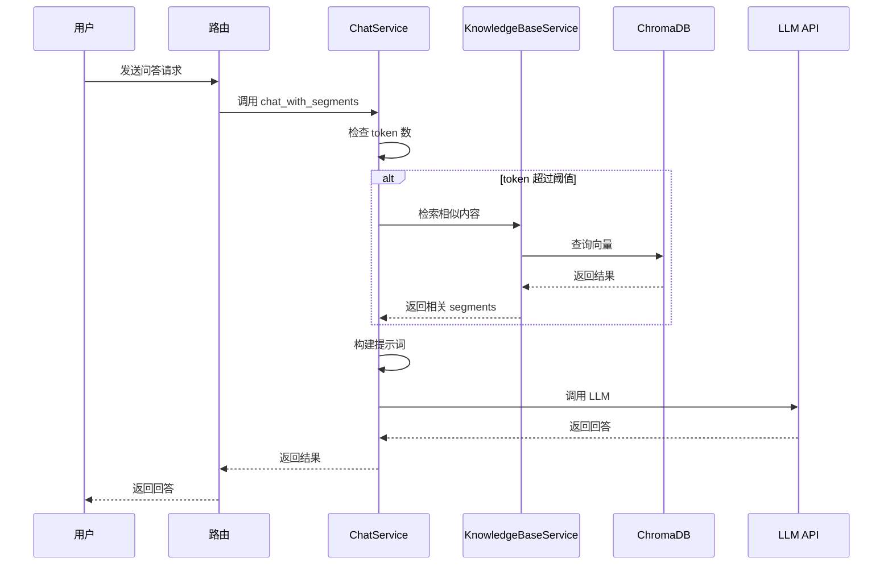

# HearSight 知识库使用设计文档

## 概述

本文档描述如何使用 HearSight 知识库服务，包括 KnowledgeBaseService 和 ChatService 的使用方法、API 接口以及集成指南。

### 使用流程图



## 服务使用

### KnowledgeBaseService 使用

#### 初始化

```python
from backend.services.knowledge_base_service import knowledge_base

# 全局实例已创建，可直接使用
# knowledge_base: KnowledgeBaseService
```

#### 添加转写内容

```python
# 添加视频转写句子段到知识库
video_id = "video_123"  # 可选，已废弃
segments = [
    {
        "index": 0,
        "sentence": "欢迎收看本期节目",
        "start_time": 0.0,
        "end_time": 3.5
    },
    # ... 更多句子段
]
metadata = {"transcript_id": 123}  # 必须包含 transcript_id

knowledge_base.add_transcript(video_id, segments, metadata)
```

#### 搜索相似内容

```python
# 搜索相似文档
query = "人工智能的应用"
n_results = 5
transcript_ids = [123, 456]  # 可选，限制搜索范围

results = knowledge_base.search_similar(query, n_results, transcript_ids)

# 返回格式
# [
#     {
#         "doc_id": "123_chunk_0",
#         "text": "人工智能在医疗领域...",
#         "metadata": {"transcript_id": 123, "chunk_index": 0, ...},
#         "distance": 0.123
#     },
#     ...
# ]
```

#### 获取文档详情

```python
# 获取文档详细信息
doc_id = "123_chunk_0"
db_url = "postgresql://..."  # 数据库连接URL

details = knowledge_base.get_doc_details(doc_id, db_url)

# 返回格式
# {
#     "doc_id": "123_chunk_0",
#     "transcript_id": 123,
#     "chunk_index": 0,
#     "chunk_text": "人工智能在医疗领域...",
#     "sentences": [
#         {
#             "index": 0,
#             "sentence": "人工智能在医疗领域",
#             "start_time": 100.0,
#             "end_time": 105.0,
#             "spk_id": 1
#         },
#         ...
#     ]
# }
```

#### 获取所有转写ID

```python
# 获取所有 transcript_id
transcript_ids = knowledge_base.get_transcript_ids()
# 返回: [123, 456, ...]
```

### ChatService 使用

### ChatService 初始化

```python
from backend.services.chat_service import chat_service

# 全局实例已创建，可直接使用
# chat_service: ChatService
```

#### 基于分句问答

```python
# 基础问答（不使用知识库）
segments = [
    {
        "index": 0,
        "sentence": "人工智能正在改变生活",
        "start_time": 0.0,
        "end_time": 3.5
    },
    # ... 更多句子段
]
question = "人工智能对生活有哪些影响？"
api_key = "your_api_key"
base_url = "https://api.example.com/v1"
model = "gpt-3.5-turbo"

response = chat_service.chat_with_segments(
    segments=segments,
    question=question,
    api_key=api_key,
    base_url=base_url,
    model=model
)
print(response)  # AI 回答文本
```

#### 智能问答（自动使用知识库）

```python
# 当 token 数超过阈值时，自动检索相关内容
transcript_id = 123  # 指定转写ID，用于知识库检索

response = chat_service.chat_with_segments(
    segments=segments,
    question=question,
    api_key=api_key,
    base_url=base_url,
    model=model,
    transcript_id=transcript_id
)
# 系统会自动：
# 1. 从数据库获取该 transcript_id 的完整转录稿
# 2. 计算完整转录稿的 token 数
# 3. 如果 ≤ 阈值，直接使用完整转录稿
# 4. 如果 > 阈值，从知识库检索相关内容，按句子顺序重新排列
# 5. 用检索到的内容替代原 segments 进行问答
```

## API 接口

### 聊天路由

#### POST /chat

基于分句内容进行问答。

**请求体**:

```json
{
  "segments": [
    {
      "index": 0,
      "sentence": "句子内容",
      "start_time": 0.0,
      "end_time": 3.5
    }
  ],
  "question": "用户问题",
  "transcript_id": 123,  // 可选，用于知识库检索
  "api_key": "your_api_key",  // 可选，从配置读取
  "base_url": "https://api.example.com/v1",  // 可选
  "model": "gpt-3.5-turbo"  // 可选
}
```

**响应**:

```json
{
  "answer": "AI 回答内容，包含时间戳引用"
}
```

**错误响应**:

```json
{
  "detail": "错误信息"
}
```

## 集成指南

### 在其他服务中集成

```python
from backend.services.knowledge_base_service import knowledge_base
from backend.services.chat_service import chat_service

# 在转写完成后添加知识库
def after_transcription(transcript_id, segments):
    metadata = {"transcript_id": transcript_id}
    knowledge_base.add_transcript("", segments, metadata)

# 在删除转写时清理知识库
def before_transcription_delete(transcript_id):
    # 使用条件删除清理向量数据
    knowledge_base.collection.delete(where={"transcript_id": str(transcript_id)})
```

### 配置要求

- **环境变量**:
  - `OPENAI_API_KEY`: 嵌入模型 API 密钥
  - `OPENAI_BASE_URL`: 嵌入模型 API 基础URL
  - `CHAT_MAX_WINDOWS`: 聊天最大 token 限制（默认 1000000）

- **依赖**:
  - chromadb: 向量数据库
  - openai: 嵌入生成
  - litellm: LLM 调用

### 性能优化

- **批量操作**: 添加多个转写时，考虑批量处理以提高效率
- **缓存**: 对于频繁查询的内容，可以缓存向量嵌入
- **异步处理**: 嵌入生成可以异步执行，避免阻塞主流程

### 错误处理

- **API 调用失败**: 检查网络连接和 API 密钥
- **数据库连接**: 确保 ChromaDB 和 PostgreSQL 正常运行
- **数据一致性**: 添加和删除操作要同步执行

## 示例代码

### 完整问答流程

```python
import os
from backend.services.chat_service import chat_service

# 设置环境变量
os.environ["OPENAI_API_KEY"] = "your_key"
os.environ["OPENAI_BASE_URL"] = "https://api.example.com/v1"

# 准备数据
segments = [
    {"index": 0, "sentence": "AI 技术发展迅速", "start_time": 0, "end_time": 5},
    {"index": 1, "sentence": "应用领域广泛", "start_time": 5, "end_time": 10}
]
question = "AI 有什么应用？"

# 调用问答
answer = chat_service.chat_with_segments(
    segments=segments,
    question=question,
    api_key=os.getenv("OPENAI_API_KEY"),
    base_url=os.getenv("OPENAI_BASE_URL"),
    model="gpt-3.5-turbo",
    transcript_id=123  # 启用知识库检索
)

print(f"回答: {answer}")
```

### 知识库管理

```python
from backend.services.knowledge_base_service import knowledge_base

# 添加内容
segments = [...]  # 转写句子段
knowledge_base.add_transcript("", segments, {"transcript_id": 123})

# 搜索
results = knowledge_base.search_similar("机器学习", 3, [123])
for result in results:
    print(f"相似度: {1 - result['distance']:.3f}")
    print(f"内容: {result['text'][:100]}...")
```