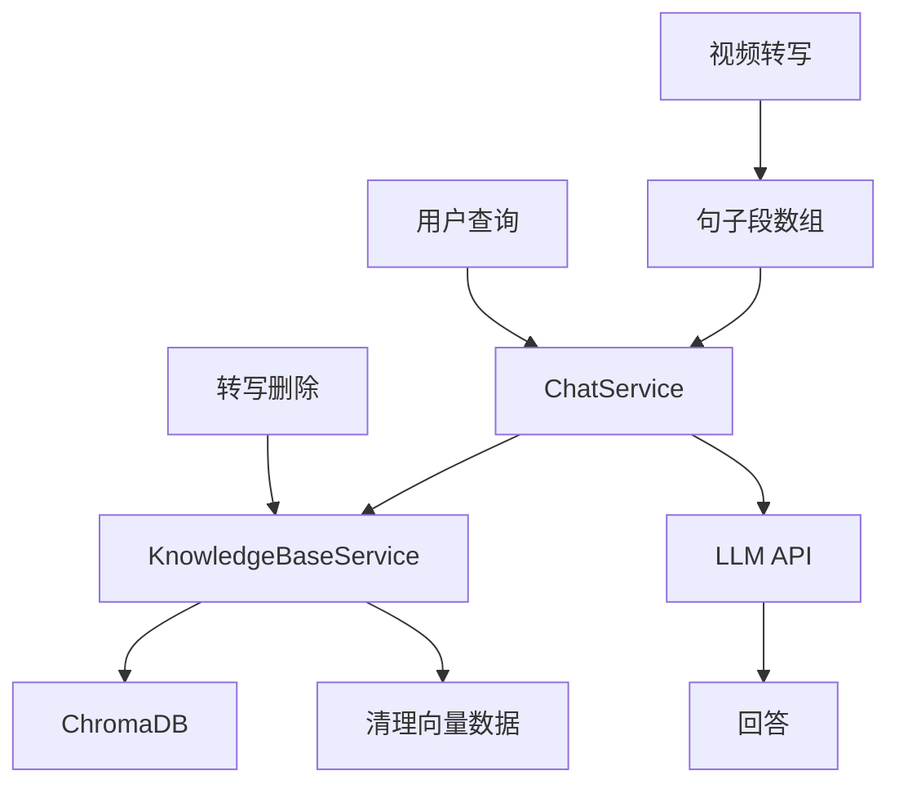
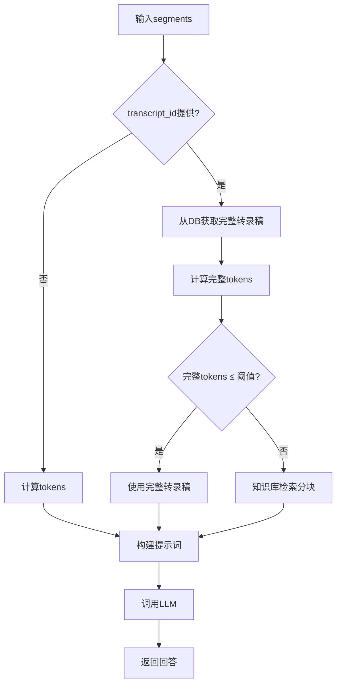

# HearSight 知识库结构设计文档

## 概述

HearSight 知识库基于 ChromaDB 向量数据库实现，支持多视频转写内容的语义检索。通过将视频转写句子段组装成文本块并生成向量嵌入，实现高效的内容搜索。

## 设计原则

### 核心理念

- **语义优先**：基于向量相似度而非关键词匹配，实现智能内容检索
- **模块解耦**：知识库独立于转写流程，支持灵活的数据管理和扩展
- **性能平衡**：在检索精度、存储效率和查询速度之间取得最优平衡
- **数据完整性**：确保转写数据的添加和删除操作完全同步，避免孤立数据

### 架构特点

- **单一集合设计**：所有向量数据集中管理，简化运维复杂度
- **最小元数据原则**：只存储必要回查信息，减少存储开销
- **条件操作支持**：利用向量数据库的原生条件查询和删除能力

## 核心设计

### 数据组织方式

- **输入数据**: 视频转写结果的句子段数组，每个句子段包含 `index`、`sentence`、`start_time`、`end_time` 等字段
- **处理方式**: 将句子段按字符长度（约2000字符）组装成文本块
- **存储单元**: 每个文本块作为一个向量文档，包含：
  - 向量嵌入（使用 BAAI/bge-m3 模型）
  - 原始文本内容
  - 元数据（视频ID、块索引、时间范围、句子数量等）

### 块大小选择

- **块大小**: 2000字符
- **考虑因素**:
  - 嵌入模型上下文长度限制（8192）
  - 检索粒度平衡（过小增加向量数量，过大降低检索精度）
  - 中文字符特点（一个汉字约占2-3字节）

### 元数据结构

每个向量文档的元数据包含最小回查信息：

```json
{
  "transcript_id": "关联的 transcripts 表的 ID",
  "chunk_index": "块在转写中的索引（从0开始的块顺序号，用于标识第几个块）",
  "segment_indices": "块包含的句子段索引数组（例如 [0,1,2] 表示块由第0、1、2个句子组成）"
}
```

**字段详细说明**：

- `transcript_id`：关联的 transcripts 表记录 ID，便于从数据库获取完整转写数据和句子详细信息。
- `chunk_index`：块的顺序索引（整数，从0开始），用于区分同一个转写中的多个块。例如，一个长转写可能被分成多个块，第0块、第1块等。这个索引是块级别的标识符，便于快速定位和命名（如 `doc_id` 为 `{transcript_id}_chunk_{chunk_index}`）。
- `segment_indices`：块内包含的句子索引数组（整数列表），用于精确重建块的内容。因为块是由多个句子动态组装的，这个数组指定了块由哪些句子组成。例如 `[0,1,2]` 表示块包含转写中的第0、1、2个句子。通过这个数组，可以从数据库的 `segments_json` 中提取对应的句子文本和时间戳。

## 服务架构

### 整体架构图



### 数据流图



### KnowledgeBaseService 类

- **位置**: `backend/services/knowledge_base_service.py`
- **职责**: 封装 ChromaDB 操作，提供向量检索接口
- **主要方法**:
  - `add_transcript()`: 添加转写内容到知识库
  - `search_similar()`: 搜索相似内容
  - `get_doc_details()`: 获取文档详细信息
  - `_group_segments_into_chunks()`: 私有方法，组装句子块

### ChatService 类

- **位置**: `backend/services/chat_service.py`
- **职责**: 整合聊天逻辑和知识库服务
- **主要方法**:
  - `chat_with_segments()`: 基于分句内容进行问答，支持知识库检索
  - `_build_prompt()`: 构建聊天提示词
  - `_count_tokens_for_segments()`: 计算 token 数

## 工作流程

### 问答处理流程

#### 1. 接收问答请求

当用户发起问答请求时：

1. **检查是否指定转录稿ID**：
   - 如果提供了 `transcript_id`，表示用户希望基于特定视频的转录稿进行问答。
   - 如果未提供，则直接使用前端传递的 segments。

2. **智能内容选择**：
   - **指定转录稿ID时**：
     - 从数据库获取该ID的完整转录稿内容。
     - 计算完整转录稿的token数。
     - 如果token数 ≤ LLM上下文阈值，直接使用完整转录稿，确保提供最全面的上下文。
     - 如果token数 > 阈值，使用向量检索获取最相关的分块内容，然后按句子在原视频中的顺序重新排列，确保内容连贯性。
   - **未指定转录稿ID时**：
     - 直接使用前端提供的segments内容。

#### 2. 内容处理

- 对选定的内容进行token计算和限制检查。
- 构建包含时间戳的提示词。
- **检索内容模板**：当使用知识库检索时，采用层次化标签系统：

  ```text
  [文件开始: example_video.mp4]
    [块开始: 1 - 索引: 0-2]
    [0.00-3.50] 句子1
    [3.50-8.20] 句子2
    [块结束: 1]
    
    [块开始: 2 - 索引: 5-7]
    [25.00-28.50] 句子5
    [28.50-32.10] 句子6
    [块结束: 2]
  [文件结束: example_video.mp4]

  请注意：以上内容来自同一视频的不同块，不保证时间连续性。
  ```

- 调用LLM生成回答。

### 3. 转写完成触发

当视频转写任务完成后，自动触发知识库更新：

1. 获取转写结果的句子段数组
2. 按2000字符大小组装成文本块
3. 为每个文本块生成向量嵌入
4. 将向量和元数据存储到 ChromaDB

### 4. 转写删除触发

当删除转写记录时，同步清理知识库数据：

1. 从数据库删除转写记录
2. 删除对应的媒体文件
3. **清理向量数据库**：
   - 获取向量数据库中所有文档的元数据
   - 筛选出 `transcript_id` 匹配的文档ID
   - 批量删除匹配的向量文档
   - 记录删除的向量块数量

**删除逻辑实现**：

```python
# 使用条件删除：直接按 transcript_id 删除所有相关向量（高效推荐方式）
knowledge_base.collection.delete(where={"transcript_id": transcript_id})
```

**优势**：ChromaDB 原生支持 `where` 参数条件删除，无需先查询所有文档，性能更好且代码更简洁。

## 架构优势

### 性能优势

- **高效检索**：向量相似度搜索比传统关键词匹配更智能
- **快速删除**：条件删除避免全集合扫描，支持大数据量场景
- **增量更新**：支持实时添加新内容，无需重建索引

### 可维护性

- **数据一致性**：添加和删除操作完全同步，保证数据完整性
- **模块独立**：知识库服务独立部署，便于维护和扩展
- **配置灵活**：支持不同的嵌入模型和参数配置
