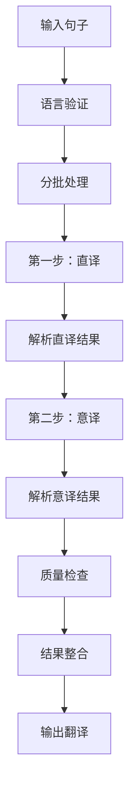

# 翻译服务设计文档

## 概述

本文档描述了翻译服务的设计方案，采用"直译 + 意译"两步翻译法实现高质量的双语翻译，支持中文和英文的双向互译。

## 架构设计

### 核心模块

- **core.py**: 主控翻译流程，负责分批处理、进度回调和结果整合
- **two_step_translate.py**: 两步翻译核心逻辑，实现直译和意译步骤
- **prompt.py**: 构建高质量的翻译提示词，支持直译和意译场景
- **parser.py**: 从LLM响应中提取JSON格式的翻译结果
- **batch.py**: 按token限制智能分批句子，避免单次请求过大

### 翻译流程



## 核心实现

### 两步翻译法

系统采用两步翻译法提升翻译质量：

1. **直译步骤**: 准确传达原文信息，确保不遗漏事实和背景
2. **意译步骤**: 基于直译结果优化表达，使翻译更自然流畅

### 技术特点

- **异步处理**: 使用asyncio支持并发翻译，提高效率
- **智能分批**: 根据token限制自动分组，避免请求失败
- **错误恢复**: 意译失败时自动使用直译结果，确保可用性
- **质量保证**: 双重检查确保翻译准确性和自然度
- **重试机制**: 对失败翻译进行分组重试，提高成功率

### 语言支持

仅支持双语翻译：

- 中文 (zh) ↔ 英文 (en)
- 自动语言检测或手动指定

## 核心代码结构

### TwoStepTranslator类

```python
class TwoStepTranslator:
    async def translate_batch(self, segments, source_lang, target_lang, all_segments, max_tokens):
        # 第一步：直译
        literal_translations = await self._literal_translate(...)
        
        # 第二步：意译
        final_translations = await self._meaning_translate(...)
        
        return final_translations
```

### 提示词设计

#### 直译提示词

强调信息完整性和准确性：

- 准确传达原文事实和背景
- 保留英文术语并加空格
- 保持原文结构和逻辑

#### 意译提示词

基于直译结果优化表达：

- 对照原文确保内容准确
- 符合目标语言表达习惯
- 提升自然度和可读性

### 翻译执行流程

1. **输入验证**: 检查语言支持和参数有效性
2. **分批处理**: 按输出token限制分组句子
3. **直译执行**: 调用LLM进行直译，温度0.3确保准确性
4. **意译执行**: 基于直译结果进行意译，温度0.6提升自然度
5. **结果解析**: 提取JSON格式的翻译结果
6. **质量检查**: 验证翻译有效性，记录失败案例
7. **重试机制**: 对失败翻译进行分组重试
8. **结果整合**: 更新原句子对象，返回完整结果

## 配置和依赖

- **LLM模型**: 通过路由器调用，支持流式响应
- **超时设置**: 120秒请求超时
- **Token限制**: 默认4096，重试时降至2048
- **温度参数**: 直译0.3，意译0.6

## 性能优化

- **批处理**: 充分利用token额度，减少API调用次数
- **异步并发**: 支持多批次并发翻译
- **连接复用**: 通过路由器优化HTTP连接
- **失败重试**: 分组重试失败翻译，提高成功率
