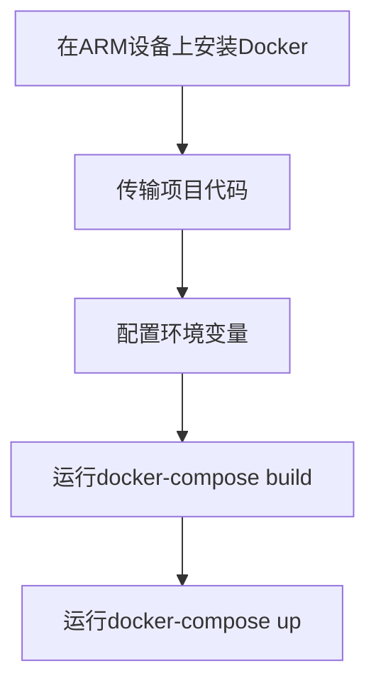
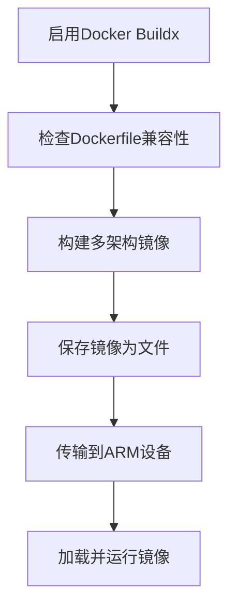

# ARM设备Docker构建指南

## 概述

本指南介绍如何将HearSight项目的Docker镜像构建并部署到ARM架构设备上。如ARM设备资源充足，推荐直接在ARM设备上构建；否则，使用交叉构建方式。

## 构建流程

### 直接构建流程（推荐）



### 交叉构建流程（备选）



## 选择合适的docker-compose文件

HearSight项目提供多个docker-compose文件，根据运行环境选择：

- **docker-compose.cloud.yml**：适用于Windows主机，使用build指令构建镜像，云端ASR模式。
- **docker-compose.cloud.linux.yml**：适用于Linux主机，使用build指令构建镜像，云端ASR模式。
- **docker-compose.cloud.arm.linux.yml**：适用于ARM Linux设备，使用预构建的image指令，云端ASR模式。
- **docker-compose.local.yml**：适用于Linux主机，使用build指令构建镜像，本地ASR模式（需要CUDA支持）。

根据主机操作系统和ASR模式选择相应文件：

- Windows（云端ASR）：使用docker-compose.cloud.yml
- Linux（云端ASR）：使用docker-compose.cloud.linux.yml
- ARM Linux（云端ASR）：使用docker-compose.cloud.arm.linux.yml
- Linux（本地ASR）：使用docker-compose.local.yml

**重要说明**：对于ARM设备，推荐优先使用云端模式的docker-compose文件（如docker-compose.cloud.arm.linux.yml），因为本地的语音识别docker需要依赖CUDA，而ARM设备上CUDA支持有限或配置复杂。云端模式使用阿里云DashScope API，无需本地GPU资源。

## 配置环境变量

运行docker-compose前，创建环境变量文件：

- **backend/.env**：后端服务配置，包含数据库、API密钥等。
- **ASRBackend/.env**：ASR后端配置，包含API密钥等。

参考项目中的.env.example文件。

### 获取API密钥

- **语音识别模型密钥 (DASHSCOPE_API_KEY)**：前往阿里云百炼控制台获取DashScope API密钥。
- **Supabase配置**：前往 [Supabase官网](https://supabase.com/) 注册并创建项目。选择Public bucket，配置策略为：允许用户上传文件到名为asr的存储桶，文件名以.wav结尾，用户为<lixiuqixiaoke@qq.com>。

示例backend/.env内容：

```
POSTGRES_USER=hearsight
POSTGRES_PASSWORD=hearsight_pass
POSTGRES_DB=hearsight
BACKEND_PORT=9999
FRONTEND_PORT=10000
OPENAI_API_KEY=your_key
# 其他变量...
```

示例ASRBackend/.env内容：

```
ASR_MODE=cloud
DASHSCOPE_API_KEY=your_key
SUPABASE_URL=https://your-project.supabase.co
SUPABASE_KEY=your-anon-key-here
SUPABASE_BUCKET_NAME=test-public
SUPABASE_FOLDER_NAME=asr
SUPABASE_ADMIN_EMAIL=your-admin-email@example.com
SUPABASE_ADMIN_PASSWORD=your-admin-password
```

确保.env文件不提交到版本控制。

## 直接在ARM设备上构建

如果ARM设备资源充足，直接在ARM设备上构建镜像。

### 步骤

1. 在ARM设备上安装Docker。
2. 配置Docker镜像加速。
3. 传输项目代码到ARM设备：

   ```
   scp -r C:\Users\ke\Downloads\HearSight root@arm-ip:/home/ke123/
   ```

   或使用U盘传输。

4. 创建环境变量文件。
5. 构建并运行：

   ```
   cd /home/ke123/HearSight
   docker-compose -f docker-compose.cloud.linux.yml build
   docker-compose -f docker-compose.cloud.linux.yml up -d
   ```

### 优势

- 无需x86主机。
- 无需传输大文件。
- 确保兼容性。

### 注意

- ARM设备需足够资源。
- 构建时间较长。
- 网络慢时配置加速。

## 交叉构建到ARM设备

如果ARM设备资源有限，在x86主机上交叉构建ARM64镜像，然后传输。

### 详细步骤

1. 启用Docker Buildx：

   ```
   docker buildx create --use
   ```

2. 检查Dockerfile兼容性，确保基础镜像支持ARM64。
3. 构建多架构镜像：

   ```
   docker buildx build --platform linux/arm64 -t image:arm64 --load ./backend
   ```

4. 保存镜像为文件：

   ```
   mkdir -p docker-images
   docker save hearsight-backend:arm64 > docker-images/backend-arm64.tar
   docker save hearsight-frontend:arm64 > docker-images/frontend-arm64.tar
   docker save hearsight-asr-backend:arm64 > docker-images/asr-backend-arm64.tar
   docker save hearsight-celery-worker:arm64 > docker-images/celery-worker-arm64.tar
   ```

5. 传输到ARM设备：

   ```
   scp docker-images/*.tar user@arm-ip:/path/
   ```

   或使用U盘。

6. 在ARM设备上加载并运行：

   - 加载镜像：

     ```
     docker load < backend-arm64.tar
     docker load < frontend-arm64.tar
     docker load < asr-backend-arm64.tar
     docker load < celery-worker-arm64.tar
     ```

   - 运行服务：

     ```
     docker-compose -f docker-compose.cloud.yml up -d
     ```

     或单独运行celery-worker：

     ```
     docker run -d --name celery-worker hearsight-celery-worker:arm64 python -m backend.queues.worker_launcher
     ```

### 构建多个服务

需要构建的服务：

- backend：

  ```
  docker buildx build --platform linux/arm64 -t hearsight-backend:arm64 --load -f backend/Dockerfile .
  ```

- frontend：

  ```
  docker buildx build --platform linux/arm64 -t hearsight-frontend:arm64 --load ./frontend
  ```

- asr-backend：

  ```
  docker buildx build --platform linux/arm64 -t hearsight-asr-backend:arm64 --load -f Dockerfile.cloud .
  ```

- celery-worker：

  ```
  docker buildx build --platform linux/arm64 -t hearsight-celery-worker:arm64 --load -f backend/Dockerfile .
  ```

- redis：使用现成镜像，无需构建。

## 在ARM设备上安装Docker

如果ARM设备未安装Docker，按以下步骤安装：

```
# 更新包索引
sudo apt update

# 安装必要包
sudo apt install apt-transport-https ca-certificates curl gnupg lsb-release

# 添加Docker GPG密钥
curl -fsSL https://download.docker.com/linux/debian/gpg | sudo gpg --dearmor -o /usr/share/keyrings/docker-archive-keyring.gpg

# 添加Docker仓库
echo "deb [arch=$(dpkg --print-architecture) signed-by=/usr/share/keyrings/docker-archive-keyring.gpg] https://download.docker.com/linux/debian $(lsb_release -cs) stable" | sudo tee /etc/apt/sources.list.d/docker.list > /dev/null

# 更新包索引
sudo apt update

# 安装Docker CE
sudo apt install docker-ce docker-ce-cli containerd.io

# 启动Docker服务
sudo systemctl start docker

# 设置开机自启
sudo systemctl enable docker

# 安装Docker Compose
sudo apt install docker-compose

# 添加用户到docker组
sudo usermod -aG docker $USER
```

安装后，验证版本。

### 配置Docker镜像加速

配置镜像加速源，如<https://docker.1ms.run：>

- 全局配置：

  编辑 /etc/docker/daemon.json：

  ```
  {
    "registry-mirrors": ["https://docker.1ms.run"]
  }
  ```

  重启Docker：

  ```
  sudo systemctl restart docker
  ```

- 针对特定镜像：在docker-compose中修改image。

## 注意事项

- 确保Docker版本支持Buildx。
- 调整Dockerfile为ARM兼容。
- 构建时间长，建议在x86上进行。
- 测试ARM设备运行效果。
- 如果PyPI下载SSL错误，更换PIP_INDEX_URL为其他源，并添加PIP_TRUSTED_HOST。
