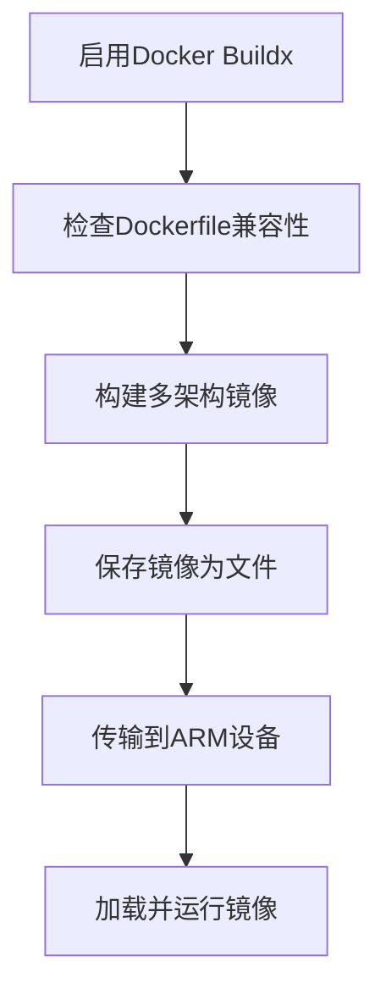

# ARM设备Docker构建指南

## 概述

本指南介绍如何将HearSight项目的Docker镜像构建并部署到ARM架构设备上（如ARM64处理器）。通过使用Docker Buildx工具，实现多平台构建，确保镜像兼容ARM设备。

## 构建流程

以下是构建多架构Docker镜像的流程：



### 详细步骤

1. **启用Docker Buildx**：

   ```bash
   docker buildx create --use
   ```

   （创建并启用Buildx builder，用于多平台构建；`--use` 设置为默认builder）

2. **检查Dockerfile兼容性**：确保基础镜像和依赖支持ARM64平台，例如使用`FROM ubuntu:22.04`等通用镜像。

3. **构建多架构镜像**：

   ```bash
   docker buildx build --platform linux/arm64 -t image:arm64 --load ./backend
   ```

   （`--platform linux/arm64` 指定目标平台为ARM64；`-t image:arm64` 标签镜像；`--load` 将镜像加载到本地Docker daemon；`./backend` 构建上下文目录）

4. **保存镜像为文件**：

   ```bash
   mkdir -p docker-images
   docker save hearsight-backend:arm64 > docker-images/backend-arm64.tar
   docker save hearsight-frontend:arm64 > docker-images/frontend-arm64.tar
   docker save hearsight-asr-backend:arm64 > docker-images/asr-backend-arm64.tar
   docker save hearsight-celery-worker:arm64 > docker-images/celery-worker-arm64.tar
   ```

   （创建`docker-images`目录保存所有tar文件，便于管理；`docker save` 导出镜像为tar文件；`>` 重定向输出到文件；`docker-images/`已添加到`.gitignore`忽略）

5. **传输到ARM设备**：

   - 使用SSH传输：

     ```bash
     scp docker-images/*.tar user@arm-ip:/path/
     ```

     （`scp` 安全复制文件；`user@arm-ip` 用户名和IP；`/path/` 目标路径；在ARM设备上运行`ip addr show`或`hostname -I`查看IP，选择类似192.168.x.x的主机IP，忽略广播地址如.x.255）

   - 或者用硬盘（U盘等）物理复制文件到ARM设备。

6. **在ARM设备上加载并运行**：

   - 加载镜像：

     ```bash
     docker load < backend-arm64.tar
     docker load < frontend-arm64.tar
     docker load < asr-backend-arm64.tar
     docker load < celery-worker-arm64.tar
     ```

   - 使用compose运行所有服务（假设ARM设备有docker-compose）：

     ```bash
     docker-compose -f docker-compose.cloud.yml up -d
     ```

     （这会启动backend、frontend、asr-backend、celery-worker等服务；celery-worker会自动运行其command启动worker）

   - 或单独运行celery-worker：

     ```bash
     docker run -d --name celery-worker hearsight-celery-worker:arm64 python -m backend.queues.worker_launcher
     ```

     （`-d` 后台运行；指定command启动worker）

### 构建多个服务

根据`docker-compose.cloud.yml`，需要构建的服务如下：

- **backend**（使用`backend/Dockerfile`）：

  ```bash
  docker buildx build --platform linux/arm64 -t hearsight-backend:arm64 --load -f backend/Dockerfile .
  ```

  （上下文为根目录`.`，Dockerfile为`backend/Dockerfile`；`-f` 指定Dockerfile路径）

- **frontend**（使用`./frontend/Dockerfile`）：

  ```bash
  docker buildx build --platform linux/arm64 -t hearsight-frontend:arm64 --load ./frontend
  ```

  （上下文为`./frontend`，Dockerfile为`Dockerfile`）

- **asr-backend**（使用`./ASRBackend/Dockerfile.cloud`）：

  ```bash
  docker buildx build --platform linux/arm64 -t hearsight-asr-backend:arm64 --load -f Dockerfile.cloud .
  ```

  （上下文为`.`，Dockerfile为`Dockerfile.cloud`；`-f` 指定Dockerfile文件名）

- **celery-worker**（使用`backend/Dockerfile`）：

  ```bash
  docker buildx build --platform linux/arm64 -t hearsight-celery-worker:arm64 --load -f backend/Dockerfile .
  ```

  （上下文为根目录`.`，Dockerfile为`backend/Dockerfile`；`-f` 指定Dockerfile路径；与backend相同）

- **redis**：使用现成镜像`redis:7-alpine`，支持ARM64，无需构建，直接拉取或传输。

## 在ARM设备上安装Docker

如果ARM设备（Debian系统）没有安装Docker，按以下步骤安装：

```bash
# 更新包索引
sudo apt update

# 安装必要的包
sudo apt install apt-transport-https ca-certificates curl gnupg lsb-release

# 添加Docker的官方GPG密钥
curl -fsSL https://download.docker.com/linux/debian/gpg | sudo gpg --dearmor -o /usr/share/keyrings/docker-archive-keyring.gpg

# 添加Docker仓库
echo "deb [arch=$(dpkg --print-architecture) signed-by=/usr/share/keyrings/docker-archive-keyring.gpg] https://download.docker.com/linux/debian $(lsb_release -cs) stable" | sudo tee /etc/apt/sources.list.d/docker.list > /dev/null

# 更新包索引
sudo apt update

# 安装Docker CE
sudo apt install docker-ce docker-ce-cli containerd.io

# 启动Docker服务
sudo systemctl start docker

# 设置开机自启
sudo systemctl enable docker

# 安装Docker Compose
sudo apt install docker-compose

# 添加当前用户到docker组（避免每次sudo）
sudo usermod -aG docker $USER

# 重新登录或运行新终端生效
```

（安装后，运行`docker --version`和`docker-compose --version`验证）

### 配置Docker镜像加速（可选）

如果网络慢，可以配置镜像加速源（如<https://docker.1ms.run>）：

- **全局配置**（推荐）：

  ```bash
  # 创建或编辑daemon.json
  sudo nano /etc/docker/daemon.json
  ```

  添加内容：

  ```json
  {
    "registry-mirrors": ["https://docker.1ms.run"]
  }
  ```

  ```bash
  # 重启Docker服务
  sudo systemctl restart docker
  ```

  （这会加速所有镜像拉取，如Redis）

- **针对特定镜像**：在`docker-compose.cloud.yml`中修改image，例如将`image: redis:7-alpine`改为`image: docker.1ms.run/redis:7-alpine`（如果加速源支持此格式）。

（验证：`docker pull redis:7-alpine`或compose拉取）

## 注意事项

- 确保Docker版本支持Buildx（19.03+）。
- 如果Dockerfile中有特定架构依赖，需要调整为ARM兼容版本。
- 构建时间可能较长，建议在x86主机上进行多平台构建。
- 测试镜像在ARM设备上的运行效果。
- ARM设备运行Debian时，确保镜像兼容。
- 如果遇到PyPI下载SSL错误（如从清华镜像），可以更换PIP_INDEX_URL为其他源，如`https://pypi.org/simple`或阿里云`https://mirrors.aliyun.com/pypi/simple`，并添加`PIP_TRUSTED_HOST=mirrors.aliyun.com`。
