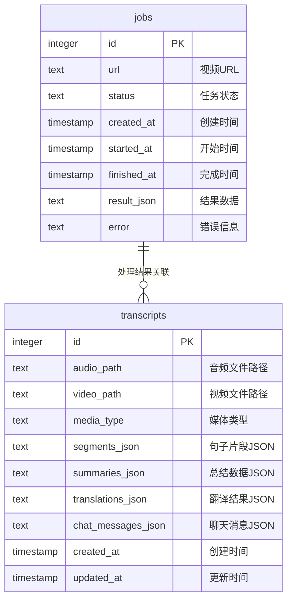

# HearSight 数据库设计文档

## 概述

HearSight 系统使用 PostgreSQL 数据库存储任务处理和转写结果信息。数据库包含两个主要表：`jobs` 和 `transcripts`，它们通过逻辑关联形成完整的数据流。

## 数据库表结构

### 1. jobs 表 - 任务队列

任务队列表存储所有视频处理任务的状态和结果信息。

| 字段名 | 类型 | 约束 | 说明 |
|--------|------|------|------|
| id | SERIAL | PRIMARY KEY | 任务唯一标识 |
| url | TEXT | NOT NULL | 视频URL地址 |
| status | TEXT | NOT NULL DEFAULT 'pending' | 任务状态 |
| created_at | TIMESTAMP | NOT NULL DEFAULT now() | 创建时间 |
| started_at | TIMESTAMP | NULL | 开始处理时间 |
| finished_at | TIMESTAMP | NULL | 完成时间 |
| result_json | TEXT | NULL | 处理结果（JSON格式） |
| error | TEXT | NULL | 错误信息 |
| celery_task_id | VARCHAR(255) | NULL | Celery任务ID |

**状态枚举值：**

- `pending`: 等待处理
- `running`: 正在处理
- `success`: 处理成功
- `failed`: 处理失败

### 2. transcripts 表 - 转写记录

转写记录表存储音频转文字的处理结果。

| 字段名 | 类型 | 约束 | 说明 |
|--------|------|------|------|
| id | SERIAL | PRIMARY KEY | 转写记录唯一标识 |
| audio_path | TEXT | NOT NULL | 音频文件路径 |
| video_path | TEXT | NULL | 视频文件路径 |
| media_type | TEXT | NOT NULL DEFAULT 'audio' | 媒体类型（'audio' 或 'video'） |
| segments_json | TEXT | NOT NULL | 句子片段数据（JSON格式） |
| summaries_json | TEXT | NULL | 总结数据（JSON格式） |
| translations_json | TEXT | NULL | 翻译结果（JSON格式，按语言代码组织） |
| chat_messages_json | TEXT | NULL | 聊天消息数据（JSON格式） |
| created_at | TIMESTAMP | NOT NULL DEFAULT now() | 创建时间 |
| updated_at | TIMESTAMP | NOT NULL DEFAULT now() | 更新时间 |

## 表间关系

## 数据流说明

### 任务处理流程

1. **任务创建**: 用户提交视频URL，创建 `jobs` 记录，状态为 `pending`
2. **任务领取**: 后台worker领取 `pending` 状态的任务，更新为 `running`
3. **下载阶段**: 下载视频文件，更新 `result_json` 中的 `media_path`
4. **ASR阶段**: 处理音频转文字，创建 `transcripts` 记录，更新 `result_json` 中的 `transcript_id`
5. **任务完成**: 更新任务状态为 `success` 或 `failed`

### 关联关系

- **jobs.result_json**: 存储处理过程中的中间结果和最终结果
  - `media_path`: 下载的视频文件路径
  - `transcript_id`: 关联的转写记录ID
  - `basename`: 文件名
  - `static_url`: 静态文件访问URL

- **transcripts.audio_path**: 指向实际的音频文件
- **transcripts.video_path**: 指向实际的视频文件（如果有）
- **transcripts.media_type**: 媒体类型，区分音频和视频
- **transcripts.segments_json**: 存储ASR处理后的句子片段数据
- **transcripts.summaries_json**: 存储生成的总结数据（主题、摘要、时间范围）
- **transcripts.translations_json**: 存储翻译结果，按语言代码组织
  - 结构: `{ "zh": [...], "en": [...] }`
  - 每个翻译项包含：index、sentence、translation、start_time、end_time
- **transcripts.chat_messages_json**: 存储聊天消息数据（用于对话功能）

## 索引设计

### 性能优化索引

1. **jobs表索引**:
   - `idx_jobs_status_created`: 在 `status` 和 `created_at DESC` 上创建复合索引，用于快速查询不同状态的任务，按创建时间倒序

2. **transcripts表索引**:
   - `idx_transcripts_audio_path`: 在 `audio_path` 上创建索引，用于通过音频文件路径快速查找转写记录
   - `idx_transcripts_updated_at`: 在 `updated_at DESC` 上创建索引，用于按更新时间倒序查询转写记录

## 业务规则

### 数据完整性

1. **任务状态流转**:
   - `pending` → `running` → `success`/`failed`
   - 不允许跳跃状态或回退

2. **级联关系**:
   - 删除转写记录时，会同时删除对应的媒体文件
   - 任务失败时，`error` 字段存储错误信息

3. **数据一致性**:
   - `result_json` 中的 `transcript_id` 必须对应有效的 `transcripts` 记录
   - `media_path` 必须指向实际存在的文件

4. **总结和翻译**:
   - 总结和翻译结果通过后端自动保存
   - 重新生成总结或翻译时，自动覆盖旧数据
   - `updated_at` 字段记录最后一次更新时间
