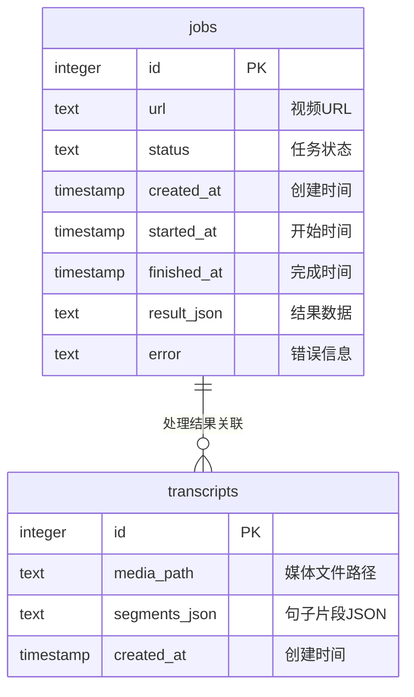

# HearSight 数据库设计文档

## 概述

HearSight 系统使用 PostgreSQL 数据库存储任务处理和转写结果信息。数据库包含两个主要表：`jobs` 和 `transcripts`，它们通过逻辑关联形成完整的数据流。

## 数据库表结构

### 1. jobs 表 - 任务队列

任务队列表存储所有视频处理任务的状态和结果信息。

| 字段名 | 类型 | 约束 | 说明 |
|--------|------|------|------|
| id | SERIAL | PRIMARY KEY | 任务唯一标识 |
| url | TEXT | NOT NULL | 视频URL地址 |
| status | TEXT | NOT NULL DEFAULT 'pending' | 任务状态 |
| created_at | TIMESTAMP | NOT NULL DEFAULT now() | 创建时间 |
| started_at | TIMESTAMP | NULL | 开始处理时间 |
| finished_at | TIMESTAMP | NULL | 完成时间 |
| result_json | TEXT | NULL | 处理结果（JSON格式） |
| error | TEXT | NULL | 错误信息 |

**状态枚举值：**

- `pending`: 等待处理
- `running`: 正在处理
- `success`: 处理成功
- `failed`: 处理失败

### 2. transcripts 表 - 转写记录

转写记录表存储音频转文字的处理结果。

| 字段名 | 类型 | 约束 | 说明 |
|--------|------|------|------|
| id | SERIAL | PRIMARY KEY | 转写记录唯一标识 |
| media_path | TEXT | NOT NULL | 媒体文件路径 |
| segments_json | TEXT | NOT NULL | 句子片段数据（JSON格式） |
| created_at | TIMESTAMP | NOT NULL DEFAULT now() | 创建时间 |

## 表间关系



## 数据流说明

### 任务处理流程

1. **任务创建**: 用户提交视频URL，创建 `jobs` 记录，状态为 `pending`
2. **任务领取**: 后台worker领取 `pending` 状态的任务，更新为 `running`
3. **下载阶段**: 下载视频文件，更新 `result_json` 中的 `media_path`
4. **ASR阶段**: 处理音频转文字，创建 `transcripts` 记录，更新 `result_json` 中的 `transcript_id`
5. **任务完成**: 更新任务状态为 `success` 或 `failed`

### 关联关系

- **jobs.result_json**: 存储处理过程中的中间结果和最终结果
  - `media_path`: 下载的视频文件路径
  - `transcript_id`: 关联的转写记录ID
  - `basename`: 文件名
  - `static_url`: 静态文件访问URL

- **transcripts.media_path**: 指向实际的媒体文件
- **transcripts.segments_json**: 存储ASR处理后的句子片段数据

## 索引设计

### 性能优化索引

1. **jobs表索引**:

   ```sql
   CREATE INDEX idx_jobs_status_created
   ON jobs(status, created_at DESC);
   ```

   - 用于快速查询不同状态的任务，按创建时间倒序

2. **transcripts表索引**:

   ```sql
   CREATE INDEX idx_transcripts_media_path
   ON transcripts(media_path);
   ```

   - 用于通过媒体文件路径快速查找转写记录

## 业务规则

### 数据完整性

1. **任务状态流转**:
   - `pending` → `running` → `success`/`failed`
   - 不允许跳跃状态或回退

2. **级联关系**:
   - 删除转写记录时，会同时删除对应的媒体文件
   - 任务失败时，`error` 字段存储错误信息

3. **数据一致性**:
   - `result_json` 中的 `transcript_id` 必须对应有效的 `transcripts` 记录
   - `media_path` 必须指向实际存在的文件

### 并发处理

- 使用 `SELECT ... FOR UPDATE SKIP LOCKED` 实现任务的原子性领取
- 支持多个worker实例并发处理不同任务
- 任务重启恢复机制：重新处理状态为 `running` 但长时间未完成的任务

## 扩展性考虑

### 未来可能的扩展

1. **用户系统**: 添加用户表，支持多用户任务隔离
2. **任务类型**: 扩展支持不同类型的媒体处理任务
3. **历史记录**: 添加任务历史表，支持任务重试和统计分析
4. **文件元数据**: 扩展媒体文件元数据存储

---

最后更新时间: 2025年10月19日
