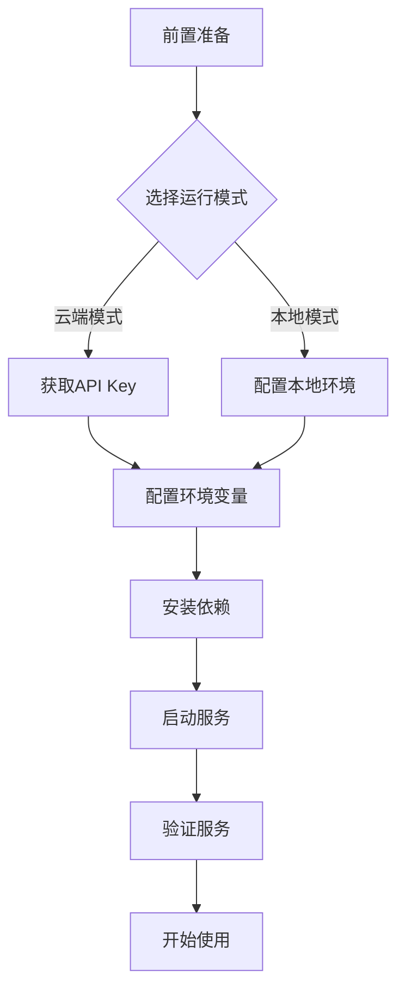

# ASR Backend 启动流程概览图

```mermaid
flowchart TD
    A[前置准备] --> B{选择运行模式}
    B -->|云端模式| C[获取API Key]
    B -->|本地模式| D[配置本地环境]
    C --> E[配置环境变量]
    D --> E
    E --> F[安装依赖]
    F --> G[启动服务]
    G --> H[验证服务]
    H --> I[开始使用]
```
