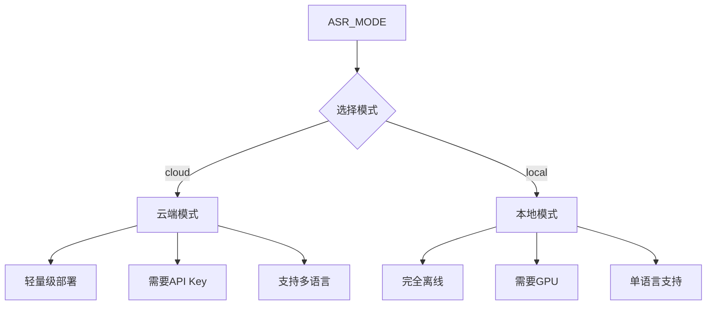

# ASR_MODE 选择模式图

```mermaid
graph TD
    A[ASR_MODE] --> B{选择模式}
    B -->|cloud| C[云端模式]
    B -->|local| D[本地模式]
    
    C --> E[轻量级部署]
    C --> F[需要API Key]
    C --> G[支持多语言]
    
    D --> H[完全离线]
    D --> I[需要GPU]
    D --> J[单语言支持]
```
