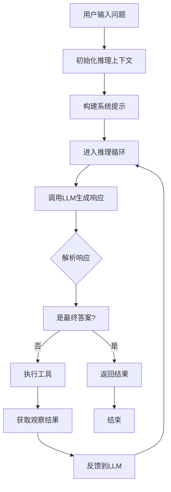

# ReAct设计文档 - 工作流程图

```mermaid
graph TD
    A[用户输入问题] --> B[初始化推理上下文]
    B --> C[构建系统提示]
    C --> D[进入推理循环]
    D --> E[调用LLM生成响应]
    E --> F{解析响应}
    F --> G[是最终答案?]
    G -->|是| H[返回结果]
    G -->|否| I[执行工具]
    I --> J[获取观察结果]
    J --> K[反馈到LLM]
    K --> D
    H --> L[结束]
```
