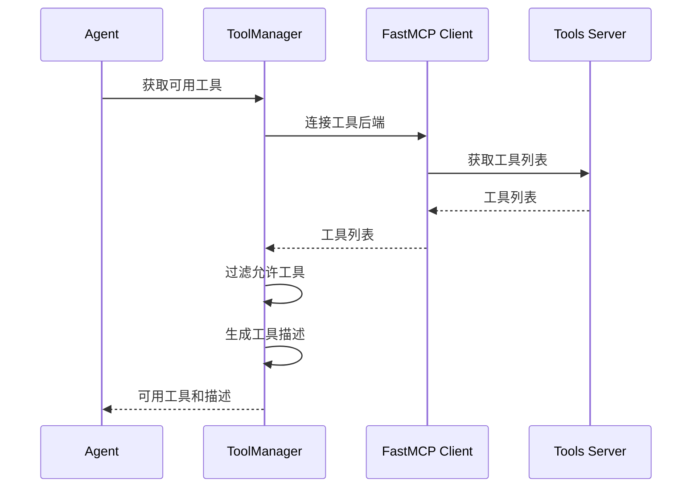

# ReAct设计文档 - 工具管理流程图

```mermaid
sequenceDiagram
    participant A as Agent
    participant TM as ToolManager
    participant C as FastMCP Client
    participant T as Tools Server
    
    A->>TM: 获取可用工具
    TM->>C: 连接工具后端
    C->>T: 获取工具列表
    T-->>C: 工具列表
    C-->>TM: 工具列表
    TM->>TM: 过滤允许工具
    TM->>TM: 生成工具描述
    TM-->>A: 可用工具和描述
```
