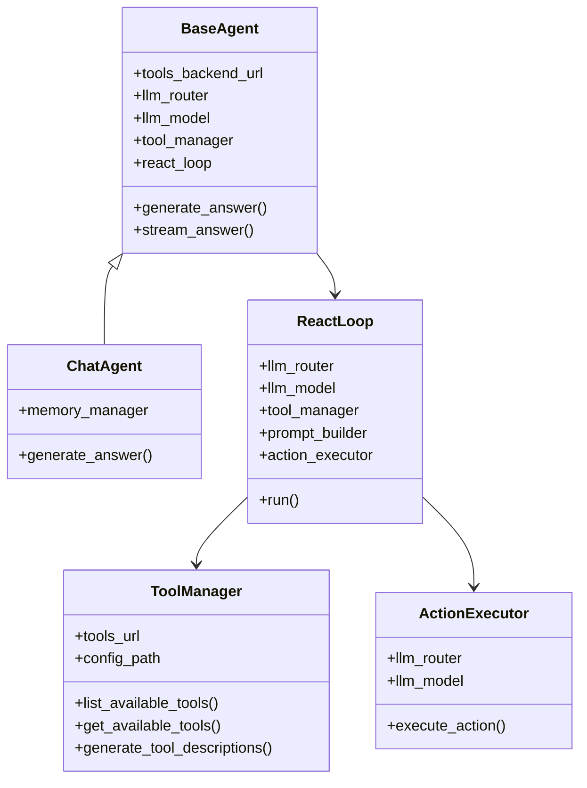

# ReAct设计文档 - 类层次结构图

```mermaid
classDiagram
    class BaseAgent {
        +tools_backend_url
        +llm_router
        +llm_model
        +tool_manager
        +react_loop
        +generate_answer()
        +stream_answer()
    }
    
    class ChatAgent {
        +memory_manager
        +generate_answer()
    }
    
    class ReactLoop {
        +llm_router
        +llm_model
        +tool_manager
        +prompt_builder
        +action_executor
        +run()
    }
    
    class ToolManager {
        +tools_url
        +config_path
        +list_available_tools()
        +get_available_tools()
        +generate_tool_descriptions()
    }
    
    class ActionExecutor {
        +llm_router
        +llm_model
        +execute_action()
    }
    
    BaseAgent <|-- ChatAgent
    BaseAgent --> ReactLoop
    ReactLoop --> ToolManager
    ReactLoop --> ActionExecutor
```
