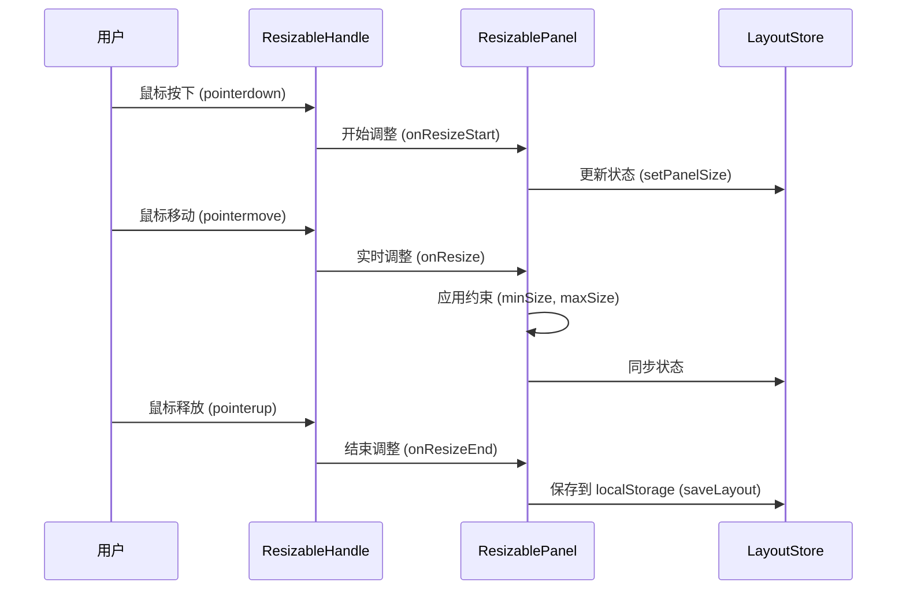

# 前端拖拽侧边栏功能设计文档 - 拖拽流程图

```mermaid
sequenceDiagram
    participant U as 用户
    participant H as ResizableHandle
    participant P as ResizablePanel
    participant S as LayoutStore

    U->>H: 鼠标按下 (pointerdown)
    H->>P: 开始调整 (onResizeStart)
    P->>S: 更新状态 (setPanelSize)
    U->>H: 鼠标移动 (pointermove)
    H->>P: 实时调整 (onResize)
    P->>P: 应用约束 (minSize, maxSize)
    P->>S: 同步状态
    U->>H: 鼠标释放 (pointerup)
    H->>P: 结束调整 (onResizeEnd)
    P->>S: 保存到 localStorage (saveLayout)
```
