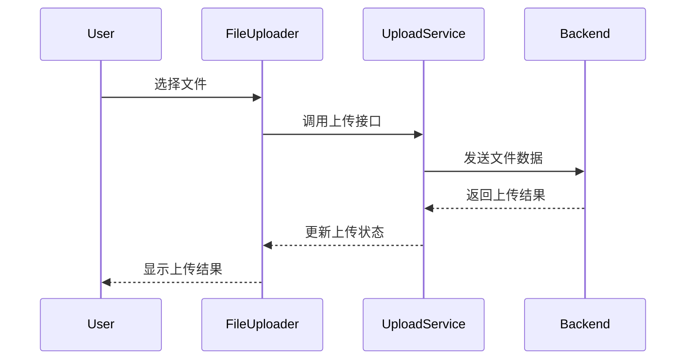

# 前端架构设计文档 - 文件上传流程图

```mermaid
sequenceDiagram
    participant User
    participant FileUploader
    participant UploadService
    participant Backend
    
    User->>FileUploader: 选择文件
    FileUploader->>UploadService: 调用上传接口
    UploadService->>Backend: 发送文件数据
    Backend-->>UploadService: 返回上传结果
    UploadService-->>FileUploader: 更新上传状态
    FileUploader-->>User: 显示上传结果
```
