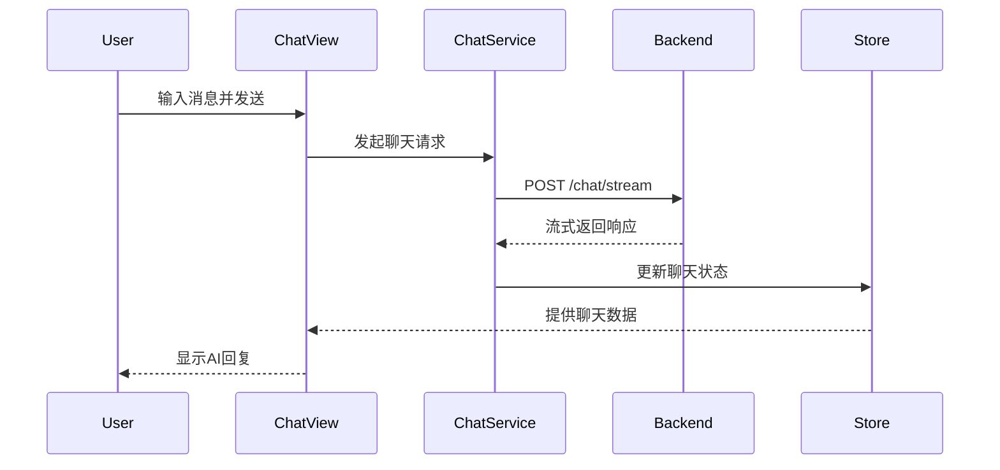

# 前端架构设计文档 - 聊天交互流程图

```mermaid
sequenceDiagram
    participant User
    participant ChatView
    participant ChatService
    participant Backend
    participant Store
    
    User->>ChatView: 输入消息并发送
    ChatView->>ChatService: 发起聊天请求
    ChatService->>Backend: POST /chat/stream
    Backend-->>ChatService: 流式返回响应
    ChatService->>Store: 更新聊天状态
    Store-->>ChatView: 提供聊天数据
    ChatView-->>User: 显示AI回复
```
