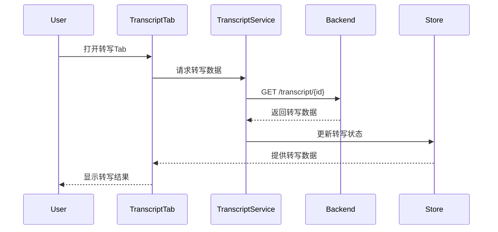

# 前端架构设计文档 - 转写结果显示流程图

```mermaid
sequenceDiagram
    participant User
    participant TranscriptTab
    participant TranscriptService
    participant Backend
    participant Store
    
    User->>TranscriptTab: 打开转写Tab
    TranscriptTab->>TranscriptService: 请求转写数据
    TranscriptService->>Backend: GET /transcript/{id}
    Backend-->>TranscriptService: 返回转写数据
    TranscriptService->>Store: 更新转写状态
    Store-->>TranscriptTab: 提供转写数据
    TranscriptTab-->>User: 显示转写结果
```
