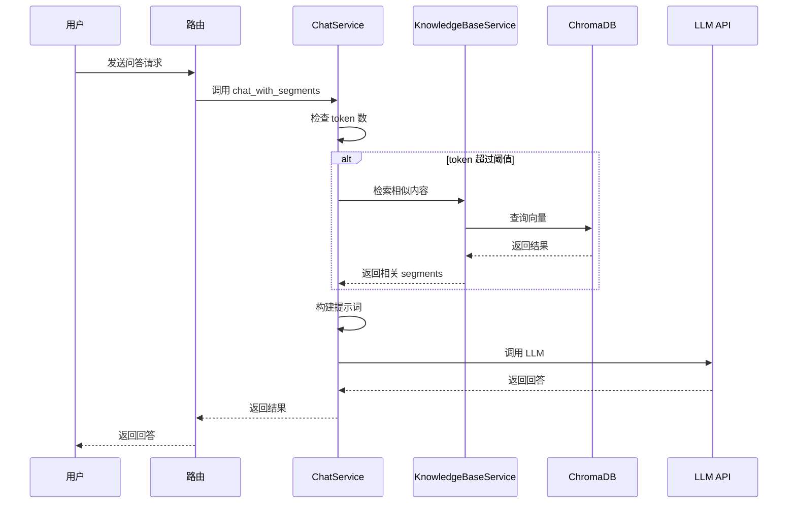

# 知识库使用设计文档 - 使用流程图

```mermaid
sequenceDiagram
    participant U as 用户
    participant R as 路由
    participant C as ChatService
    participant K as KnowledgeBaseService
    participant DB as ChromaDB
    participant LLM as LLM API

    U->>R: 发送问答请求
    R->>C: 调用 chat_with_segments
    C->>C: 检查 token 数
    alt token 超过阈值
        C->>K: 检索相似内容
        K->>DB: 查询向量
        DB-->>K: 返回结果
        K-->>C: 返回相关 segments
    end
    C->>C: 构建提示词
    C->>LLM: 调用 LLM
    LLM-->>C: 返回回答
    C-->>R: 返回结果
    R-->>U: 返回回答
```
