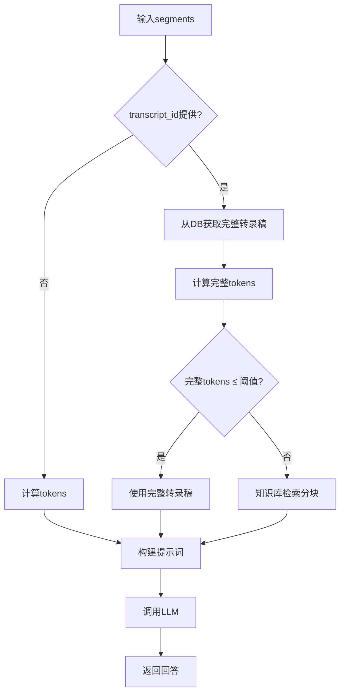

# 知识库结构设计文档 - 数据流图

```mermaid
flowchart TD
    A[输入segments] --> B{transcript_id提供?}
    B -->|否| C[计算tokens]
    B -->|是| D[从DB获取完整转录稿]
    D --> E[计算完整tokens]
    E --> F{完整tokens ≤ 阈值?}
    F -->|是| G[使用完整转录稿]
    F -->|否| H[知识库检索分块]
    C --> I[构建提示词]
    G --> I
    H --> I
    I --> J[调用LLM]
    J --> K[返回回答]
```
