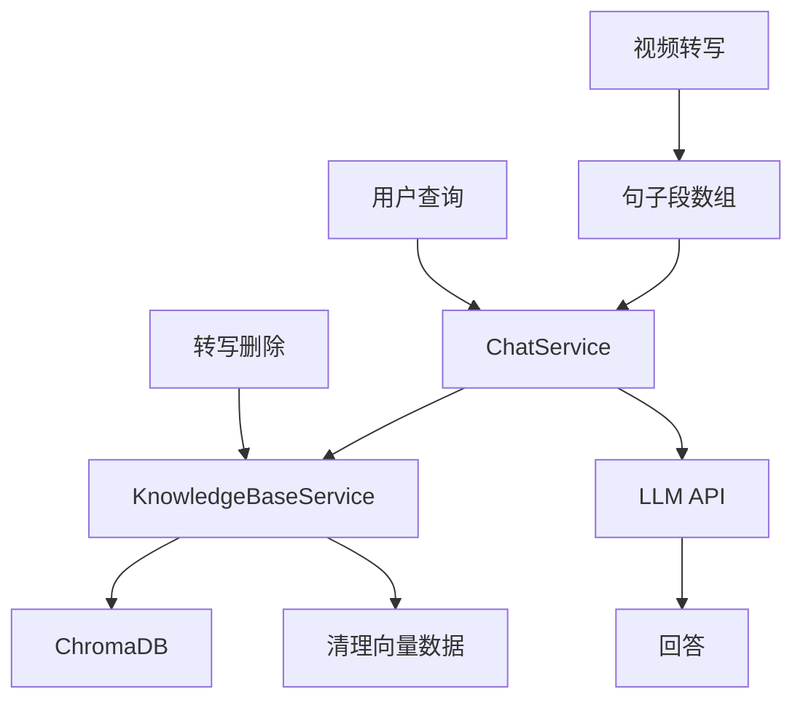

# 知识库结构设计文档 - 整体架构图

```mermaid
graph TB
    A[视频转写] --> B[句子段数组]
    B --> C[ChatService]
    C --> D[KnowledgeBaseService]
    D --> E[ChromaDB]
    
    F[用户查询] --> C
    C --> G[LLM API]
    G --> H[回答]
    
    I[转写删除] --> D
    D --> J[清理向量数据]
```
