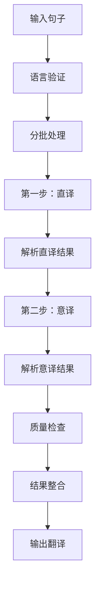

# 翻译服务设计文档 - 翻译流程图

```mermaid
graph TD
    A[输入句子] --> B[语言验证]
    B --> C[分批处理]
    C --> D[第一步：直译]
    D --> E[解析直译结果]
    E --> F[第二步：意译]
    F --> G[解析意译结果]
    G --> H[质量检查]
    H --> I[结果整合]
    I --> J[输出翻译]
```
