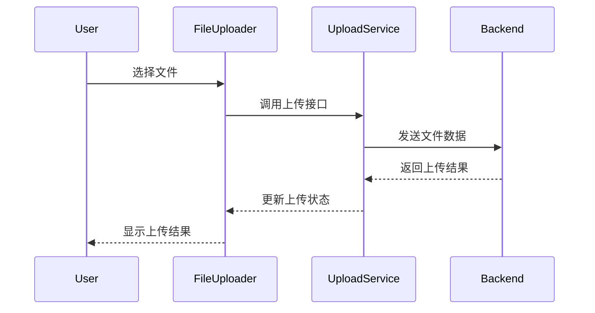
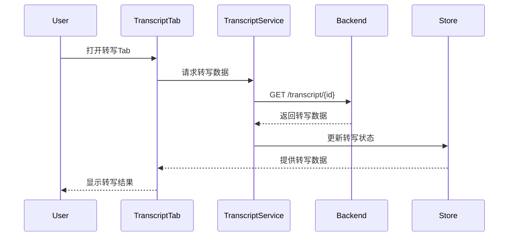
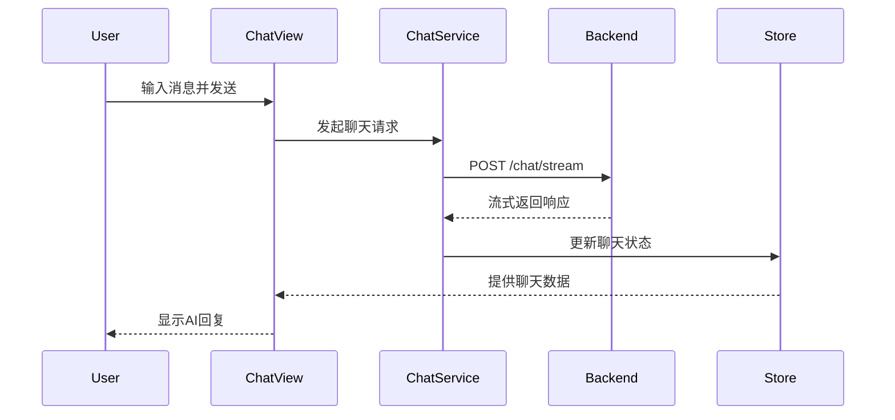

# HearSight 前端架构设计文档

## 概述

HearSight 前端是整个应用的用户界面层，基于 React 19、TypeScript 和 Vite 构建，采用现代化的前端技术栈。该应用提供了直观友好的用户界面，让用户能够轻松上传媒体文件、查看转写结果、进行翻译、生成摘要以及与 AI 进行对话。

## 技术栈

- **核心框架**: React 19
- **语言**: TypeScript
- **构建工具**: Vite
- **包管理**: npm
- **UI 组件库**: shadcn/ui
- **样式**: Tailwind CSS
- **状态管理**: Zustand
- **路由**: React Router v7
- **表单处理**: React Hook Form
- **数据验证**: Zod
- **动画**: Framer Motion
- **通知系统**: Sonner

## 项目结构

```
src/
├── App.tsx                  # 应用根组件
├── main.tsx                 # 应用入口文件
├── routes.tsx               # 路由配置
├── HomePage/                # 首页模块
│   ├── HomePage.tsx         # 首页组件
│   └── components/          # 首页组件
├── features/                # 功能模块
│   ├── app/                 # 主应用功能
│   └── chat/                # 聊天功能
├── components/              # 共享组件
│   ├── LeftPanel/           # 左侧面板
│   ├── RightPanel/          # 右侧面板
│   ├── ui/                  # UI 组件库
│   └── 其他通用组件
├── services/                # API 服务层
├── stores/                  # 状态管理
├── hooks/                   # 自定义 Hooks
├── utils/                   # 工具函数
├── types/                   # 类型定义
└── lib/                     # 第三方库配置
```

## 核心架构

### 路由架构

应用采用基于路由的模块化设计，目前有两个主要路由：

1. `/` - 首页 (HomePage)
2. `/app` - 主应用界面 (AppPage)

路由使用 React Router v7 实现，通过 [routes.tsx](../routes.tsx) 进行配置。

### 状态管理架构

应用使用 Zustand 进行全局状态管理，主要包括以下几个 store：

- 全局应用状态
- 上传和处理任务状态
- 转写记录状态
- 聊天会话状态

状态管理采用模块化设计，每个功能模块都有自己的状态管理逻辑，同时通过全局状态进行协调。

### 组件架构

前端组件按照功能划分为几个主要部分：

#### 1. 页面级组件
- [HomePage](../HomePage/HomePage.tsx) - 应用首页，提供产品介绍和快速入口
- [AppPage](../features/app/AppPage.tsx) - 主应用界面，包含核心功能

#### 2. 布局组件
- 主应用布局采用三栏式设计：
  - 左侧面板：显示处理过的文件和任务列表
  - 中间主区：视频播放器和主要操作区域
  - 右侧面板：显示转写、翻译、摘要和聊天等功能

#### 3. 功能面板组件
- **左侧面板** ([LeftPanel](../components/LeftPanel/LeftPanel.tsx))
  - 处理过的文件列表
  - 当前任务状态
  
- **右侧面板** ([RightPanel](../components/RightPanel/RightPanel.tsx))
  - 转写文本展示
  - 翻译结果展示
  - 摘要内容展示
  - 聊天对话界面

#### 4. UI 组件库
基于 shadcn/ui 构建的可复用 UI 组件，位于 [components/ui/](../components/ui/) 目录。

### 服务层架构

服务层封装了所有与后端 API 的交互，位于 [services/](../services/) 目录：

- [chatService.ts](../services/chatService.ts) - 聊天相关 API
- [downloadService.ts](../services/downloadService.ts) - 下载相关 API
- [progressService.ts](../services/progressService.ts) - 进度查询 API
- [summaryService.ts](../services/summaryService.ts) - 摘要相关 API
- [thumbnailService.ts](../services/thumbnailService.ts) - 缩略图相关 API
- [transcriptService.ts](../services/transcriptService.ts) - 转写记录相关 API
- [translateService.ts](../services/translateService.ts) - 翻译相关 API

服务层采用函数式设计，每个服务文件导出一组相关的 API 调用函数。

### 工具函数架构

工具函数位于 [utils/](../utils/) 目录，包括：

- 时间格式化工具
- 语言检测工具
- 字符串处理工具
- 数组操作工具

### 类型定义架构

类型定义位于 [types/](../types/) 目录，包括：

- API 响应类型定义
- 组件属性类型定义
- 状态管理类型定义

## 数据流设计

### 文件上传流程



### 转写结果显示流程



### 聊天交互流程

