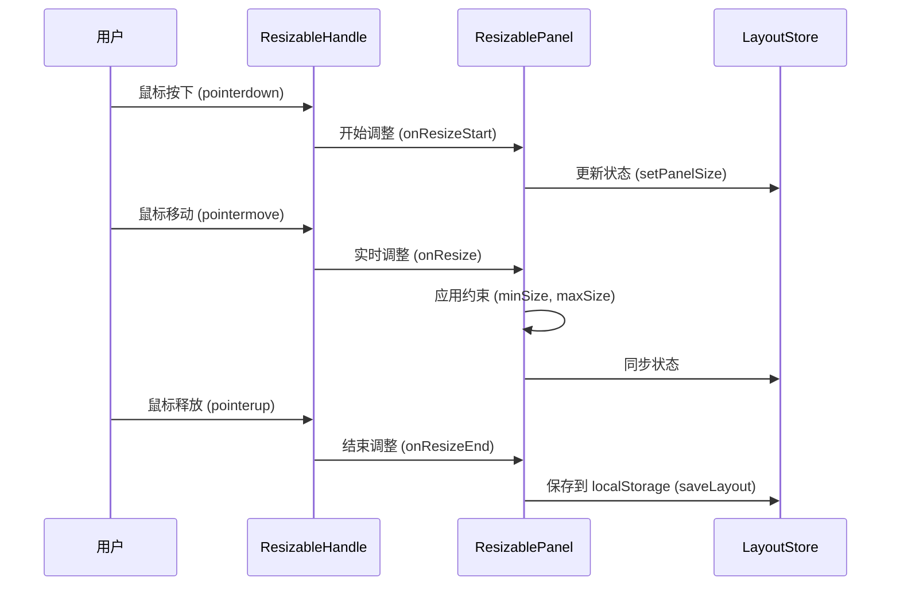

# 前端拖拽侧边栏功能设计文档

## 概述

HearSight 前端应用采用三栏布局：左侧边栏（转录列表）、主播放区域（视频播放器）、右侧边栏（分段文本）。为提升用户体验，计划添加拖拽调整侧边栏宽度的功能。由于允许大幅重构，我们将采用现代化的技术栈和架构，实现更灵活、可扩展的拖拽面板系统。

## 设计目标

- 允许用户通过拖拽分隔线调整左右侧边栏宽度
- 确保主播放区域最小宽度不低于 400px
- 限制侧边栏最大宽度不超过屏幕宽度的 40%
- 提供平滑的拖拽体验、宽度持久化、动画效果
- 支持响应式设计、暗模式、无障碍访问
- 实现模块化架构，便于未来扩展更多面板

## 技术栈选择

### 核心库
- **shadcn/ui resizable**: 基于 react-resizable-panels 的封装，用于实现可拖拽面板布局
- **@radix-ui/react-collapsible**: 用于面板的折叠/展开功能
- **framer-motion**: 用于拖拽动画和过渡效果
- **zustand**: 用于全局状态管理（宽度持久化、面板可见性等）

### 优势
- shadcn/ui resizable 提供开箱即用的拖拽功能，支持嵌套面板、约束条件、持久化
- 与现有 shadcn/ui 组件库完全一致的风格和 API
- 性能优异，使用 ResizeObserver 和 CSS transforms
- 支持键盘导航和无障碍访问
- 无需额外安装，直接使用 shadcn 的组件系统

## 架构设计

### 组件结构

```
AppLayout (根布局组件)
├── ResizablePanelGroup (shadcn/ui)
│   ├── ResizablePanel (左侧边栏)
│   │   ├── PanelContent (LeftPanel)
│   │   └── ResizableHandle (拖拽句柄)
│   ├── ResizablePanel (主播放区域)
│   │   └── PanelContent (CenterPanel)
│   └── ResizablePanel (右侧边栏)
│       ├── PanelContent (RightPanel)
│       └── ResizableHandle (拖拽句柄)
└── LayoutStore (Zustand store)
    ├── panelSizes
    ├── panelCollapsed
    ├── saveToLocalStorage
    └── responsive handling
```

### 状态管理

使用 Zustand 进行全局状态管理：

```typescript
interface LayoutState {
  // 面板大小 (百分比或像素)
  panelSizes: { left: number; center: number; right: number }
  // 面板折叠状态
  panelCollapsed: { left: boolean; right: boolean }
  // 响应式断点
  breakpoint: 'mobile' | 'tablet' | 'desktop'
  // 动作
  setPanelSize: (panel: 'left' | 'center' | 'right', size: number) => void
  togglePanel: (panel: 'left' | 'right') => void
  saveLayout: () => void
  loadLayout: () => void
}
```

### 布局实现

使用 CSS Grid + react-resizable-panels 的混合方案：

```css
.app-layout {
  display: grid;
  grid-template-columns: 
    [left-start] minmax(200px, 40vw) 
    [left-end center-start] 1fr 
    [center-end right-start] minmax(250px, 40vw) 
    [right-end];
  min-height: 100vh;
}

@media (max-width: 768px) {
  .app-layout {
    grid-template-columns: 1fr;
    grid-template-rows: auto 1fr auto;
  }
}
```

## 拖拽流程



## 约束条件

### 尺寸约束
- 左侧边栏：200px ≤ width ≤ 屏幕宽度 * 0.4
- 主播放区域：width ≥ 400px (通过面板比例计算)
- 右侧边栏：250px ≤ width ≤ 屏幕宽度 * 0.4

### 响应式约束
- 移动端 (<768px): 隐藏侧边栏，采用堆叠布局
- 平板端 (768px-1024px): 减小最小宽度约束
- 桌面端 (>1024px): 完整三栏布局

### 性能约束
- 拖拽时使用 transform 而非重排
- 节流状态更新 (requestAnimationFrame)
- 防抖持久化保存 (300ms)

## 高级特性

### 动画效果
- 拖拽句柄 hover 效果
- 面板折叠/展开的平滑动画
- 响应式布局切换动画

### 预设布局
- 提供快速切换到预设比例的按钮
- 保存用户自定义布局
- 键盘快捷键支持

### 无障碍支持
- ARIA labels 和 roles
- 键盘导航 (Tab, Arrow keys)
- 屏幕阅读器支持
- 高对比度模式

### 主题适配
- 暗模式支持
- 自定义颜色主题
- CSS 变量绑定

## 与其他模块关系

### AppPage 集成
- AppPage 作为根组件，渲染 AppLayout
- 传递面板内容 (leftPanel, centerPanel, rightPanel)
- 监听布局变化，调整内容显示

### HeaderBar 兼容
- HeaderBar 提供面板切换按钮
- 与 LayoutStore 联动，控制面板可见性
- 支持全屏模式切换

### 响应式设计
- 移动端自动切换到单栏布局
- 平板端支持侧边栏抽屉模式
- 桌面端完整三栏 + 拖拽功能

